## Trabajo de Investigación

# Code Smells
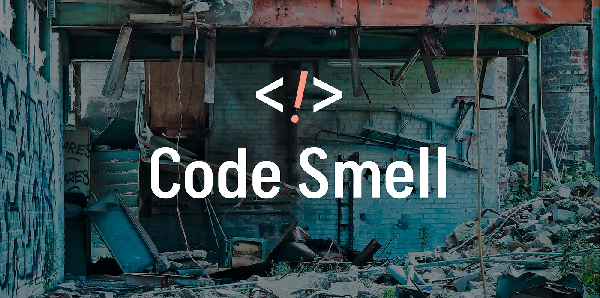
## ¿Qué son los Code Smells?

Los **Code Smells** son síntomas en el código que indican que algo podría estar mal desde la perspectiva del diseño o la estructura. Aunque no son errores o bugs que impidan el funcionamiento del programa, son señales de alerta que sugieren que ciertas áreas del código podrían causar problemas en el futuro, especialmente en términos de mantenibilidad y escalabilidad.

Algunos puntos importantes para entender sobre los **Code Smells**:

-  **No son errores funcionales**: Un sistema puede estar funcionando perfectamente aún si tuviera Code Smells.
- **Son un síntoma, no una causa**: Los Code Smells son síntomas de problemas más profundos en el diseño del software. Ignorarlos puede llevar a problemas más graves en el futuro, como la dificultad para realizar cambios o la introducción de errores involuntarios.
- **Popularizados por Martin Fowler**: El concepto de Code Smells fue introducido y popularizado por **Martin Fowler** en su libro _Refactoring: Improving the Design of Existing Code_, donde presenta un enfoque sistemático para mejorar el diseño del código sin cambiar su comportamiento externo.

**Importancia**: Los Code Smells actúan como advertencias durante el desarrollo temprano en el que ciertas áreas del código necesitan atención. Si se dejan sin corregir, pueden llevar a un software difícil de modificar y propenso a sufrir errores a largo plazo.

---

## ¿Por qué son importantes los Code Smells?

Identificar y corregir los Code Smells a tiempo es crucial por varias razones, especialmente en proyectos que tienen la intención de crecer o mantenerse a largo plazo. Los principales motivos por los que se deben tomar en serio los Code Smells:

### 1. Señales tempranas de problemas futuros
Los Code Smells funcionan como señales de alerta tempranas de que algo podría salir mal más adelante en el ciclo de vida del software. Ignorar estos indicadores puede llevar a una acumulación de complejidad técnica que, con el tiempo, puede hacer que el código sea más difícil de entender y modificar.

### 2. Impacto en la mantenibilidad
Un software con muchos Code Smells será más difícil de mantener a medida que crezca en tamaño y complejidad. Al aumentar la cantidad de código que "huele mal", los desarrolladores se ven obligados a pasar más tiempo leyendo y entendiendo el código antes de poder realizar modificaciones, lo cual puede llevar a gran pérdida de tiempo y dinero.

- **Efecto bola de nieve**: Los Code Smells tienen una naturaleza acumulativa. Un pequeño problema hoy puede no parecer importante, pero a medida que el sistema crece, esos problemas pueden acumularse y convertirse en una barrera significativa para el desarrollo.

### 3. Incremento de la deuda técnica
La **deuda técnica** se refiere a la acumulación de decisiones de diseño pobres que deben ser "pagadas" más adelante, normalmente en forma de esfuerzo adicional para realizar cambios o corregir problemas. Los Code Smells son una forma de deuda técnica, ya que incrementan el esfuerzo necesario para mantener el código limpio y funcional.

- **Costo a largo plazo**: Si no se abordan, los Code Smells pueden hacer que el código se vuelva ineficiente y requiera más tiempo y esfuerzo para realizar cambios futuros, aumentando así el costo total de mantenimiento del software.

### 4. Riesgo de errores en el futuro
Los Code Smells a menudo implican errores en el futuro del proyecto. Un código mal estructurado puede llevar a confusiones entre los desarrolladores, lo que incrementa la probabilidad de que se introduzcan errores no intencionales al realizar cambios o agregar nuevas funcionalidades.

- **Ambigüedad**: Un código difícil de entender es más propenso a errores cuando otros desarrolladores o incluso el autor original del código intentan modificarlo.

### 5. Dificultad para la expansión
El código que tiene Code Smells no solo es difícil de mantener, sino que también es difícil de expandir. La introducción de nuevas características o la modificación de las existentes se convierte en un proceso más complicado, ya que los desarrolladores deben trabajar con un diseño deficiente.

- **Barreras para el crecimiento**: A medida que una aplicación crece, los Code Smells pueden crear cuellos de botella, donde el esfuerzo para agregar nuevas funcionalidades se incrementa de manera exponencial.

---

## Tipos Comunes de Code Smells

Existen muchos tipos diferentes de Code Smells. A continuación se describen algunos de los más comunes que puedes encontrar en el código:

### 1. **Duplicated Code** (Código Duplicado)
Este es uno de los Code Smells más comunes y fáciles de detectar. Ocurre cuando el mismo fragmento de código aparece en múltiples lugares del programa. Aunque puede parecer inofensivo al principio, el código duplicado puede causar problemas a largo plazo, ya que cualquier cambio que necesite realizarse en ese código debe aplicarse en varios lugares.

- **Ejemplo**: Si tienes el mismo bloque de código para validar una entrada en dos o más lugares diferentes, estás duplicando código.
- **Consecuencias**: Cada vez que necesites modificar esa lógica, tendrás que hacerlo en varias partes del proyecto, lo que aumenta las posibilidades de introducir errores.
- **Solución**: Refactoriza el código duplicado extrayéndolo en una función o método común que pueda ser reutilizado.

### 2. **Long Method** (Método Largo)
Un método largo es uno que realiza demasiadas acciones y contiene demasiada lógica. Esto dificulta la comprensión del método y aumenta la probabilidad de errores. Los métodos largos suelen tener múltiples responsabilidades, lo que es contrario al principio de **Single Responsibility Principle** (SRP).

- **Ejemplo**: Un método que realiza la validación de datos, la transformación de esos datos y luego los guarda en una base de datos, todo en un solo bloque.
- **Consecuencias**: Cuanto más largo es un método, más difícil es de entender, probar y mantener. Los cambios en una parte del método pueden afectar otras partes no relacionadas.
- **Solución**: Divide el método en varios métodos más pequeños, cada uno con una unica responsabilidad responsabilidad.

### 3. **Large Class** (Clase Grande)
Una clase grande es aquella que maneja demasiadas responsabilidades o tiene demasiados métodos y atributos. Las clases grandes violan el principio de responsabilidad única (SRP) y pueden ser difíciles de mantener y de entender.

- **Ejemplo**: Una clase `Customer` que maneja tanto la lógica de la cuenta bancaria del cliente, la facturación, la validación de datos, etc.
- **Consecuencias**: Las clases grandes tienden a volverse difíciles de manejar, ya que encapsulan demasiadas responsabilidades. Esto puede llevar a errores cuando se realizan cambios o se introducen nuevas funcionalidades.
- **Solución**: Refactoriza la clase grande dividiéndola en clases más pequeñas, cada una con una responsabilidad clara.

### 4. **Feature Envy** (Envidia de Funcionalidad)
Este Code Smell se refiere a cuando un método parece estar más interesado en acceder a los datos de otra clase que a los datos de su propia clase. Esto indica que el método probablemente pertenece a la otra clase.

- **Ejemplo**: Un método en la clase `Order` que utiliza más atributos y métodos de la clase `Customer` que de su propia clase.
- **Consecuencias**: La clase que contiene el método está acoplando fuertemente su lógica a otra clase, lo que puede hacer que las dos clases dependan demasiado entre sí (Alto acoplamiento), dificultando la evolución del código.
- **Solución**: Mover el método a la clase que contiene los datos con los que más interactúa.

### 5. **Data Clumps** (Agrupamientos de Datos)
Este Code Smell ocurre cuando ciertas variables siempre aparecen juntas en múltiples métodos o clases. Esto sugiere que estas variables deberían estar agrupadas en una clase o estructura.

- **Ejemplo**: Variables como `firstName`, `lastName`, `phoneNumber` que aparecen juntas en varios métodos podrían agruparse en una clase `Person`.
- **Consecuencias**: Los agrupamientos de datos aumentan la probabilidad de que los desarrolladores olviden incluir o actualizar alguna de las variables relacionadas en un método.
- **Solución**: Agrupar estas variables en una clase o estructura dedicada que las encapsule.

---

## Consecuencias de no Corregir los Code Smells

Ignorar los Code Smells puede llevar a una serie de consecuencias negativas a largo plazo, algunas de las cuales incluyen:

### 1. **Mantenibilidad Reducida**
El código con Code Smells es más difícil de entender y modificar. Esto significa que cualquier cambio futuro requerirá más tiempo y esfuerzo, ya que los desarrolladores tendrán que lidiar con un diseño deficiente antes de hacer las modificaciones necesarias. A medida que aumenta la complejidad, también lo hace el tiempo requerido para comprender el código.

- **Impacto en el equipo**: Los nuevos desarrolladores tendrán más dificultades para comprender y trabajar con el código, lo que aumenta el tiempo de desarrollo.

### 2. **Mayor Probabilidad de Errores**
Cuando el código no está bien estructurado y está lleno de Code Smells, las posibilidades de introducir errores al realizar cambios aumentan considerablemente. Los desarrolladores pueden no ser conscientes de las interdependencias entre diferentes partes del código, lo que puede llevar a errores inesperados.

- **Riesgo para la calidad del software**: Los errores introducidos por una mala comprensión del código pueden afectar la estabilidad y funcionalidad del sistema.

### 3. **Aumento de la Deuda Técnica**
Cuanto más tiempo se ignoren los Code Smells, mayor será la **deuda técnica** que el equipo acumulará. Esto significa que el costo de corregir esos problemas aumentará con el tiempo, lo que puede requerir una refactorización más costosa en el futuro.

- **Impacto financiero**: La deuda técnica puede incrementar los costos de mantenimiento del software, lo que afecta tanto los recursos como el tiempo disponible para agregar nuevas funcionalidades.

### 4. **Dificultad para Agregar Nuevas Funcionalidades**
El código mal estructurado puede hacer que la introducción de nuevas funcionalidades sea una tarea mucho más compleja de lo necesario. Los desarrolladores tendrán que gastar más tiempo navegando por el código existente y lidiando con los Code Smells antes de poder implementar algo nuevo.

- **Retrasos en el desarrollo**: Los proyectos pueden retrasarse debido a la necesidad de abordar los problemas del código antes de introducir nuevas funcionalidades.

## Herramienta para la Detección de Code Smells

La identificación manual de **Code Smells** puede ser un proceso tedioso, especialmente en proyectos grandes o en crecimiento. Afortunadamente, existen herramientas automatizadas que ayudan a los desarrolladores a detectar estos problemas de diseño y estructura en el código de manera eficiente. Estas herramientas analizan el código fuente y proporcionan sugerencias sobre posibles **Code Smells**, lo que facilita su corrección temprana y mejora la mantenibilidad del software.

### SonarScanner: Detección de Code Smells

**SonarScanner** es la herramienta de análisis más utilizada de **SonarQube**, diseñada para realizar un análisis estático de código y detectar **Code Smells**, problemas de calidad y vulnerabilidades de seguridad. Es un componente clave en el ecosistema de SonarQube y permite ejecutar análisis en diversos lenguajes y proyectos a través de la línea de comandos o como parte de pipelines de integración continua (CI).

A continuación, exploraremos sus características, configuración, y cómo se utiliza para detectar **Code Smells** de manera eficiente en cualquier proyecto de software.

---

## ¿Qué es SonarScanner?

**SonarScanner** es un cliente que envía el código fuente y sus resultados de análisis a un servidor de **SonarQube** o **SonarCloud**. Analiza el código fuente para detectar problemas de calidad como **Code Smells**, vulnerabilidades de seguridad, problemas de mantenimiento y errores, proporcionando un informe exhaustivo con recomendaciones para corregir dichos problemas.

SonarScanner está diseñado para ejecutarse en varios entornos y se integra fácilmente en las fases de construcción del software, lo que permite análisis continuos a lo largo del ciclo de desarrollo.

---

## Características clave de SonarScanner

### 1. **Detección automática de Code Smells**
SonarScanner analiza el código en busca de patrones que indiquen malas prácticas o problemas estructurales conocidos como **Code Smells**. Algunos de los **Code Smells** que SonarScanner puede detectar incluyen:
- **Métodos largos**: Aquellos que tienen demasiadas líneas de código y deberían dividirse en funciones más pequeñas.
- **Clases grandes**: Clases que agrupan demasiada funcionalidad, rompiendo el principio de responsabilidad única (SRP).
- **Duplicación de código**: Bloques de código repetidos en varios lugares que indican la necesidad de refactorización.
- **Ciclos de complejidad alta**: Funciones o métodos con demasiadas ramas de control, lo que los hace difíciles de entender y mantener.
- **Variables no utilizadas**: Variables declaradas pero no utilizadas en el código.
- **Bloques de código vacíos**: Estructuras condicionales o de bucles vacías que podrían ser errores lógicos o falta de implementación.

### 2. **Soporte para múltiples lenguajes de programación**
SonarScanner soporta más de 25 lenguajes de programación, incluyendo:
- **Java**, **JavaScript**, **TypeScript**, **C#**, **C++**, **Python**, **Go**, **Ruby**, **Kotlin**, **Swift**, entre otros.
Esto lo convierte en una herramienta versátil que puede integrarse en proyectos que utilizan múltiples tecnologías.

### 3. **Informes detallados y fáciles de interpretar**
Los resultados del análisis realizado por SonarScanner se presentan en informes claros y detallados, que incluyen métricas como:
- **Severidad de los problemas**: Los **Code Smells** se clasifican en base a su severidad (menor, mayor o crítica).
- **Posibles soluciones**: Ofrece sugerencias sobre cómo refactorizar el código para mejorar su calidad.
- **Historial del proyecto**: Proporciona un seguimiento de la evolución de la calidad del código a lo largo del tiempo.

### 4. **Control de calidad continuo**
Una vez integrado, SonarScanner puede realizar análisis continuos de la base de código en cada actualización, asegurando que la calidad del software se mantenga o mejore con cada iteración.

## Instalación y uso de sonar scanner
### Pre-requisitos
1. Instalar JAVA SE (https://www.oracle.com/java/technologies/downloads) 
para evitar errores instalar le versión 17
Para validar la instalación ejecutar en la consola de comandos "java-version"
Verificar que las variables de entorno de JAVA: "echo %path%"
 ### 2. Instalación de SonarQube
Descargar SonarQube desde la página principal: https://www.sonarsource.com/products/sonarqube/downloads/
### Descomprimir el la carpeta y buscar el archivo StartSonar.bat
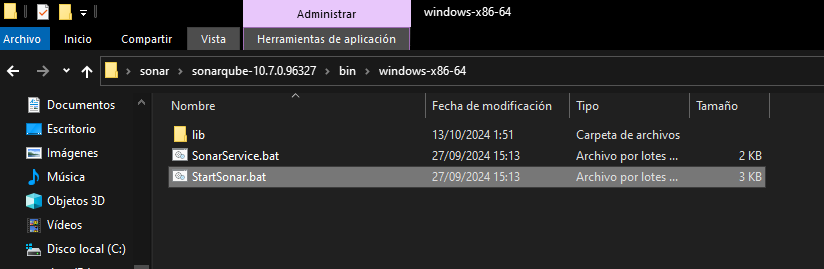
### Abrir el cmd y ejecutar el archivo:
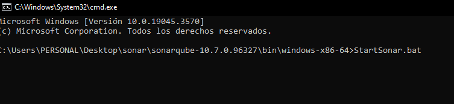
### Ingresar a http://localhost:9000/ para verificar la instalación de SonarQube
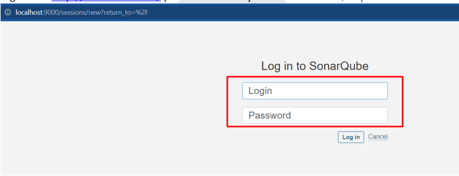
#### Usuadio y contraseña "admin", luego les pedirá que cambien su contraseña
### 3. Habilitación de SonarScanner
### Decargar y descomprimir SonarScanner https://docs.sonarsource.com/sonarqube/9.7/analyzing-source-code/scanners/sonarscanner/
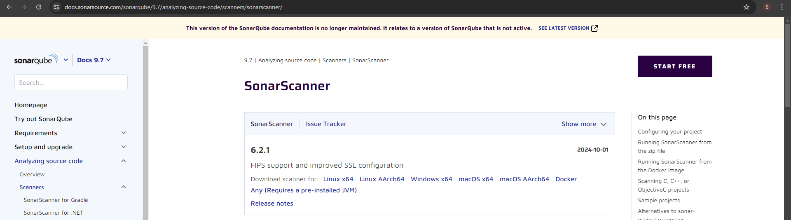
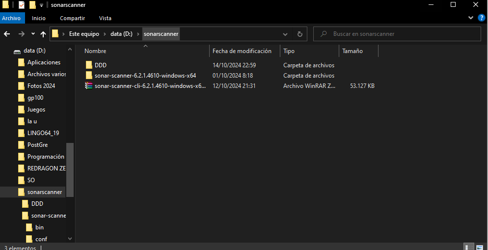

### Agregar sonar-scanner como variable de entorno
1. Copiar la ruta del bin
2. Abrir las propiedades del Sistema y Seleccionar Variables de entorno
3. Seleccionar Path
4. Seleccionar nuevo
5. Pegar ruta copiada
6. Aceptar y guardar todo

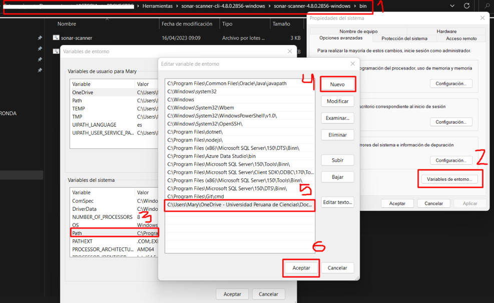
### Habilitar sonar-scanner, con cmd, ingresar a la ruta del bin y ejecutar "sonar-scanner.bat -h"

### Validar que esté habilitado en el sistema "sonar-scanner -h" y "sonar-scanner -v"
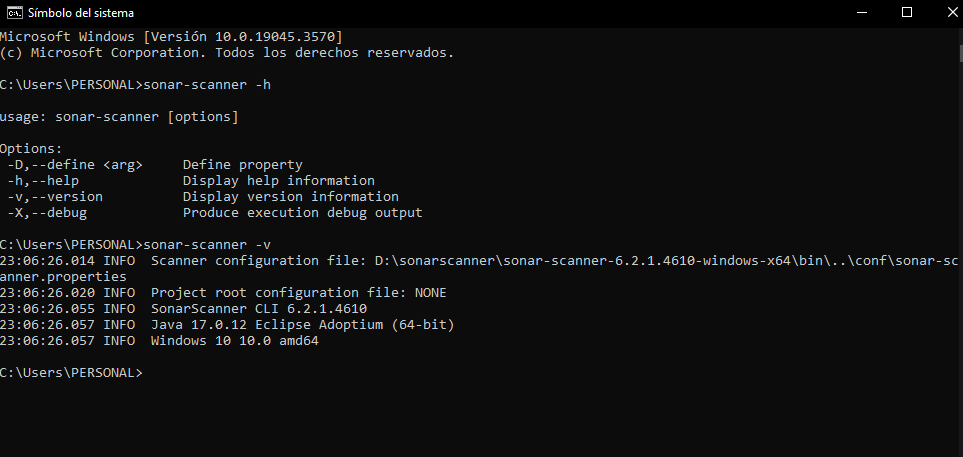

### Ir a un proyecto el cual quieras ver sus code Smells y agregar la sonar-project.properties en la ruta raiz del proyecto
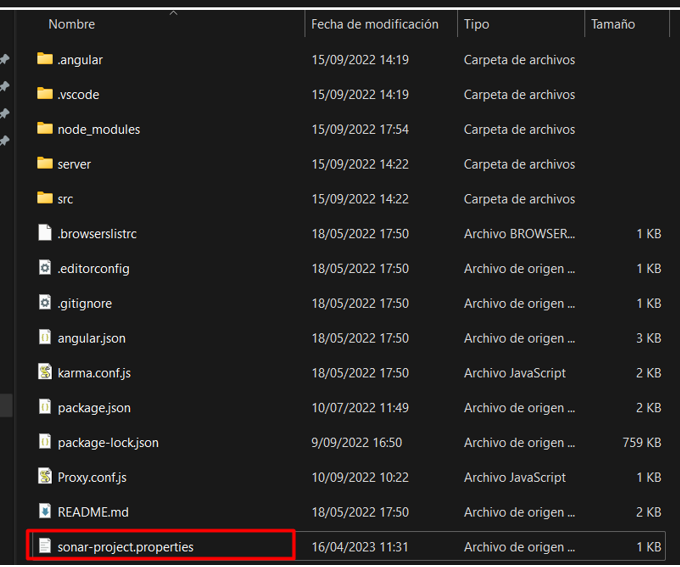

### modificar el archivo según la necesidad del proyecto, recomiendo usar la siguiente configuración
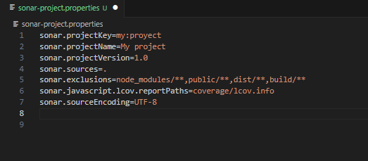

### agregar usuario y contraseña del SonarQube, modificar la configuración del conar-scanner
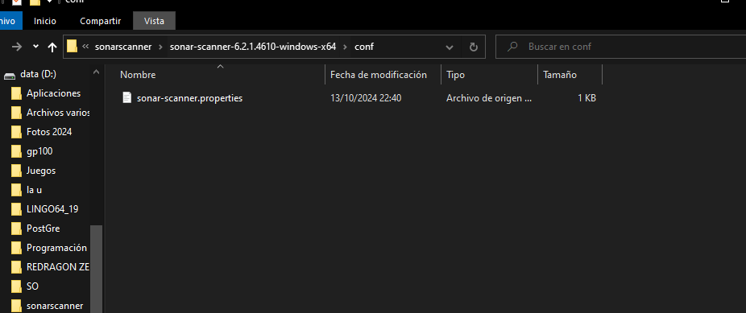
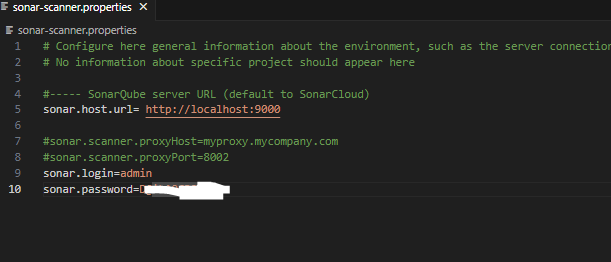

### Ingresar a la ruta raiz del proyecto y ejecutar "sonar-scanner"
### Verificar en el portal de sonarQube

# Link del Video

