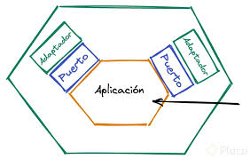

# Arquitectura Hexagonal

La arquitectura hexagonal, también conocida como el patrón de **puertos y adaptadores**, es una de las aproximaciones más influyentes en el diseño de sistemas de software modernos. Este paradigma propone una separación clara entre el núcleo de la aplicación y el mundo exterior, promoviendo flexibilidad, escalabilidad y facilidad de prueba. A continuación, exploraremos en detalle sus conceptos fundamentales y cómo esta arquitectura contribuye al desarrollo de software robusto y adaptable.
---
### 1. **El Core de la Aplicación**
En el corazón de la arquitectura hexagonal se encuentra el núcleo de la aplicación, que contiene toda la lógica empresarial. Este núcleo debe estar completamente desacoplado de detalles técnicos como bases de datos, interfaces de usuario o integraciones externas. Su principal objetivo es **modelar y resolver el problema del dominio** de manera pura.

- **Independencia tecnológica**: El núcleo no depende de frameworks, tecnologías específicas o sistemas externos.
- **Pureza lógica**: Las reglas de negocio son explícitas y están encapsuladas. Esto evita que el núcleo sea contaminado con preocupaciones externas.

---

### 2. **Puertos**
Los **puertos** son interfaces que definen los puntos de entrada y salida del núcleo de la aplicación. Actúan como contratos que especifican cómo otros componentes pueden interactuar con el sistema.

#### Tipos de Puertos
1. **Puertos de entrada**:
   - Representan las operaciones que el mundo externo puede invocar en el núcleo.
   - Ejemplo: servicios para casos de uso como "crear pedido" o "procesar pago".

2. **Puertos de salida**:
   - Permiten que el núcleo delegue tareas a sistemas externos.
   - Ejemplo: persistir datos en una base de datos, enviar un correo electrónico o consultar una API externa.

---
### 3. **Adaptadores**
Los **adaptadores** son implementaciones concretas que cumplen con los contratos definidos por los puertos. Sirven como una capa intermedia entre el núcleo de la aplicación y los detalles externos, traduciendo las interacciones entre ambos.

#### Tipos de Adaptadores
1. **Adaptadores primarios (entrada)**:
   - Conectan las interfaces externas (como una API REST, interfaz gráfica o consola) con los puertos de entrada del núcleo.
   - Transforman las solicitudes externas en formatos comprensibles para el sistema interno.

2. **Adaptadores secundarios (salida)**:
   - Implementan la interacción con sistemas externos (bases de datos, servicios web, sistemas de mensajería, etc.) según los puertos de salida definidos.
   - Garantizan que el núcleo permanezca desacoplado de implementaciones tecnológicas.

---
## Beneficios de la Arquitectura Hexagonal

1. **Desacoplamiento**:
   - La lógica de negocio está aislada de las dependencias externas, lo que facilita los cambios tecnológicos.
   - Por ejemplo, cambiar de una base de datos SQL a NoSQL o de un framework web a otro no afecta el núcleo.

2. **Testabilidad**:
   - El núcleo, al ser independiente de infraestructura, puede probarse de manera aislada utilizando puertos y adaptadores simulados (mocks o stubs).

3. **Simplicidad en la evolución**:
   - La estructura fomenta la adición de nuevas funcionalidades o integraciones externas sin comprometer la estabilidad del núcleo.

4. **Reutilización y flexibilidad**:
   - Un mismo núcleo puede ser reutilizado con diferentes adaptadores, como por ejemplo, servir tanto a una API REST como a una interfaz de línea de comandos.

## Representación Conceptual

La arquitectura hexagonal se representa como un hexágono que encapsula el núcleo, con sus puertos definidos como puntos en los bordes del hexágono. Los adaptadores externos se conectan a estos puntos, formando una "piel" alrededor del núcleo.

## Principios Fundamentales

1. **Inversión de Dependencias**:
   - El núcleo no depende de detalles técnicos, sino que define las abstracciones (puertos). Las dependencias externas (adaptadores) dependen del núcleo.

2. **Separación de responsabilidades**:
   - Cada capa cumple un rol específico: el núcleo contiene la lógica empresarial, los puertos definen contratos y los adaptadores manejan las implementaciones externas.

3. **Independencia del contexto**:
   - El núcleo puede ejecutarse en diferentes entornos (desarrollo, producción, prueba) con adaptadores adecuados.

---

## Consideraciones Prácticas

- **Diseño cuidadoso de los puertos**: Es crucial que los puertos representen las operaciones del dominio de manera clara, evitando filtraciones de conceptos tecnológicos.
- **Gestión de dependencias externas**: Los adaptadores deben encargarse de todas las interacciones externas, incluyendo la gestión de errores y la conversión de formatos.
- **Equilibrio en la abstracción**: Mientras que el desacoplamiento es importante, un diseño excesivamente genérico puede complicar el mantenimiento y la comprensión del sistema.

---

La arquitectura hexagonal no es simplemente un patrón, sino una filosofía para diseñar software que sea sostenible y evolutivo en el tiempo. Al priorizar la lógica empresarial por encima de los detalles técnicos, se construyen sistemas más sólidos, menos frágiles y capaces de adaptarse al cambio tecnológico continuo.

# DEMO

## Repositorio
### https://github.com/Sebastian1335/arquitecturaHexagonal.git
## Video
### Link video