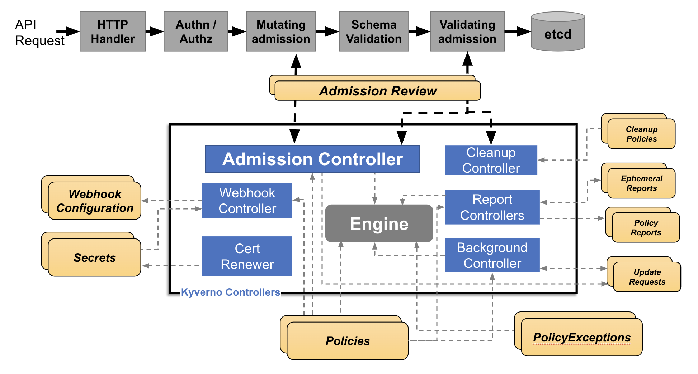

# Marco conceptual

La seguridad de contenedores hace referencia a la implementación de políticas, prácticas y herramientas que aseguran la protección de aplicaciones y servicios que se ejecutan en entornos de contenedores. Los contenedores como los que provee DOcker y Kubernetes, encapsulan aplicaciones junto con sus dependencias para brindar portabilidad y escalabilidad. Sin embargo, su naturaleza flexible también introduce desafíos específicos en términos de la seguridad de los mismos.

## Elementos clave en la seguridad de contenedores

- **Imágenes de contenedores seguras:** Las imágenes de contenedores deben provenir de fuentes oficiales, estar libres de vulnerabilidades conocidas y mantenerse actualizadas. 
- **Control de acceso:** Se refiere al uso de principios de privilegios y autenticación para garantizar que solo usuarios y procesos autorizados que los necesitan interactúen con los contenedores.
- **Políticas de seguridad en tiempo de ejecución:** Monitorear los contenedores mientras están en ejecución para identificar comportamientos anómalos que podrían indicar un ataque o vulnerabilidad.
- **Seguridad en la red:** Se refiere a la configuracion de reglas para proteger las comunicaciones internas y externas entre contenedores usado firewall y políticas de red.

## Herrmienta a usar: Kyverno

Kyverno es una herramienta de DevSecOps de política declarativa diseñada para Kubernetes. Permite a los equipos definir y validar políticas de seguridad para los recursos de Kubernetes de manera sencilla y explicable.
### Beneficios de Usar Kyverno
- Permite implementar seguridad de manera consistente en todos los entornos.
- Puede manejar políticas a gran escala en clústeres distribuidos.
- Integra con Kubernetes sin necesidad de lenguajes externos o que sean complejos.

### Flujo de la arquitectura de kyverno
- inicia con una solicitud API, que pasa por pasos de autenticación, mutación, validación de esquema y admisión.
- En el núcleo, el Admission Controller aplica las políticas mediante varios controladores. El Webhook Controller intercepta solicitudes, mientras que el Engine procesa la lógica central.
- Kyverno utiliza configuraciones de webhook, secretos y políticas como entradas. Sus salidas presentan limpieza de recursos, reportes de cumplimiento y actualizaciones procesadas, de esa manera garantiza la conformidad y automatización en la gestión de recursos de Kubernetes.

Diagrama de la arquitectura de Kyverno:

## DEMO

