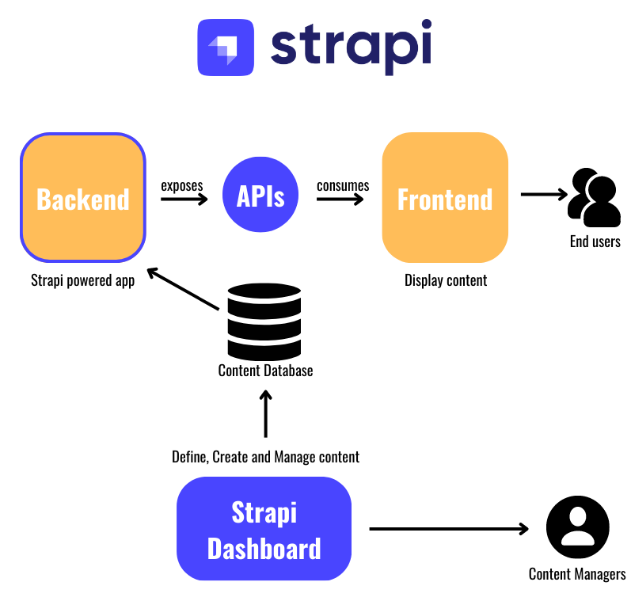
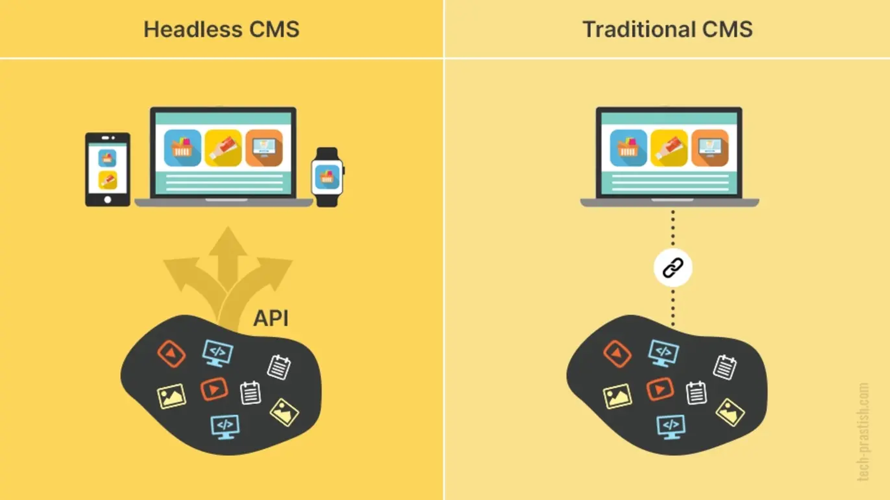

# Headless CMS: Un Enfoque Moderno para la Gestión de Contenidos

<p align="center">
    
</p>

## Introducción

En la actualidad, las aplicaciones y sitios web demandan flexibilidad, velocidad y personalización para atender a diferentes plataformas y dispositivos. Un enfoque que ha ganado popularidad es el uso de sistemas de gestión de contenido sin cabeza o **Headless CMS**. En este informe, exploraremos qué es un Headless CMS, sus ventajas y desventajas, y cómo Strapi se posiciona como una solución destacada en este ámbito.

## ¿Qué es un Headless CMS?

Un **Headless CMS** es un sistema de gestión de contenido que separa la capa de administración de contenido (backend) de la capa de presentación (frontend). A diferencia de un CMS tradicional como WordPress, donde el contenido y la presentación están estrechamente integrados, un Headless CMS entrega contenido a través de APIs, lo que permite a los desarrolladores usar cualquier tecnología frontend para la presentación.

### Características principales

- **Independencia del frontend**: Usa tecnologías modernas como React, Vue o Angular.
- **Entrega de contenido mediante APIs**: Generalmente REST o GraphQL.
- **Flexibilidad**: Permite diseñar experiencias personalizadas para múltiples plataformas.

## Ventajas de un Headless CMS

1. **Omnicanalidad**: Permite reutilizar contenido para aplicaciones web, móviles, IoT y más.
2. **Escalabilidad**: Se adapta fácilmente a proyectos complejos.
3. **Velocidad de desarrollo**: Los desarrolladores frontend pueden trabajar independientemente del backend.
4. **Seguridad mejorada**: Reduce la superficie de ataque al desconectar el backend del frontend.

## Desventajas de un Headless CMS

1. **Mayor complejidad inicial**: Requiere un diseño arquitectónico más avanzado.
2. **Costos adicionales**: En algunos casos, el hosting y la configuración pueden ser más costosos.
3. **Sin frontend prediseñado**: Los equipos deben construir el frontend desde cero.

## Comparativa: Headless CMS vs CMS Tradicional

<p align="center">
    
</p>

Para comprender mejor las ventajas y desventajas de los Headless CMS, a continuación se presenta una comparativa con los CMS tradicionales:

| **Característica**          | **Headless CMS**                                      | **CMS Tradicional**                                          |
| --------------------------- | ----------------------------------------------------- | ------------------------------------------------------------ |
| **Arquitectura**            | Backend desacoplado del frontend                      | Backend y frontend integrados                                |
| **Flexibilidad**            | Alta, permite elegir cualquier tecnología frontend    | Limitada, depende del sistema integrado                      |
| **Entrega de contenido**    | APIs (REST/GraphQL)                                   | HTML generado por el servidor                                |
| **Velocidad de desarrollo** | Rápida para proyectos con múltiples plataformas       | Más lenta en proyectos complejos                             |
| **Compatibilidad**          | Ideal para apps web, móviles, IoT y más               | Principalmente para sitios web                               |
| **Facilidad de uso**        | Requiere conocimientos técnicos avanzados             | Más fácil para usuarios sin experiencia técnica              |
| **Seguridad**               | Menos expuesto a ataques relacionados con el frontend | Más vulnerable, ya que el frontend está conectado al backend |
| **Costos**                  | Potencialmente más altos (hosting, personalización)   | Menores para proyectos pequeños                              |
| **Escalabilidad**           | Alta, adecuada para grandes volúmenes de datos        | Limitada por la arquitectura monolítica                      |
| **Frontends prediseñados**  | No incluye templates o temas                          | Ofrece plantillas listas para usar                           |

## Strapi: Una solución destacada

<p align="center">
    
</p>

### ¿Qué es Strapi?

Strapi es un **Headless CMS de código abierto** basado en Node.js. Su enfoque está en la flexibilidad y la personalización, proporcionando un panel de administración fácil de usar y soporte para APIs REST y GraphQL.

### Características clave

- **Personalización total**: Los modelos y permisos son completamente configurables.
- **Autenticación y roles**: Facilita la gestión de usuarios con roles y permisos personalizados.
- **Extensibilidad**: Permite integrar plugins y modificar el código base según las necesidades.
- **Soporte multilenguaje**: Ideal para proyectos internacionales.

### Casos de uso

- Aplicaciones de e-commerce.
- Blogs y sitios corporativos.
- Aplicaciones móviles con backend desacoplado.

## Implementación: Configuración básica de Strapi

### Requisitos previos

- **Node.js** (versión LTS recomendada).
- **npm** o **yarn**.
- Un entorno de base de datos compatible como SQLite, PostgreSQL o MongoDB.

### Pasos para la configuración

1. **Instalación de Strapi**  
   Ejecuta el siguiente comando en tu terminal para iniciar un nuevo proyecto:

   ```bash
   npx create-strapi-app@latest my-project --quickstart
   ```

   Esto instalará Strapi con SQLite como base de datos predeterminada.

2. **Iniciar el servidor de desarrollo**  
   Navega al directorio del proyecto e inicia el servidor:

   ```bash
   cd my-project
   npm run develop
   ```

3. **Creación de modelos de contenido**  
   Accede al panel de administración en `http://localhost:1337/admin`. Desde ahí, crea modelos de contenido personalizados según tus necesidades.

4. **Consumo de la API**  
   Una vez configurados los modelos, puedes consumir los endpoints generados automáticamente mediante REST o GraphQL.

## Conclusión

Los Headless CMS representan una evolución significativa en la gestión de contenido, permitiendo mayor flexibilidad y adaptabilidad para proyectos modernos. Strapi, como herramienta de código abierto, destaca por su facilidad de uso y extensibilidad, convirtiéndolo en una excelente opción para implementar este tipo de arquitectura.

## Demo

A continuación, se presenta un video que demuestra la instalación, configuración y uso de Strapi en un proyecto real.

[Enlace al video](#)

## Recursos

- [Documentación oficial de Strapi](https://strapi.io/documentation)
- [Strapi en GitHub](https://github.com/strapi/strapi)
