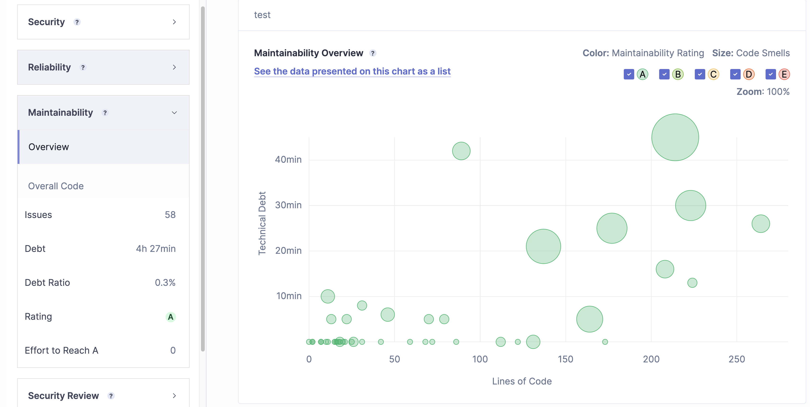

# Análisis de Código Estático

## Índice

- [Análisis de Código Estático](#análisis-de-código-estático)
  - [Índice](#índice)
  - [Fundamentos del Análisis de Código Estático](#fundamentos-del-análisis-de-código-estático)
    - [¿Qué es el Análisis de Código Estático?](#qué-es-el-análisis-de-código-estático)
    - [Propósito del Análisis Estático](#propósito-del-análisis-estático)
  - [Tipos de Errores y Problemas Detectados](#tipos-de-errores-y-problemas-detectados)
    - [1. Errores de Estilo y Convenciones](#1-errores-de-estilo-y-convenciones)
    - [2. Errores de Seguridad](#2-errores-de-seguridad)
    - [3. Problemas de Complejidad y Mantenimiento](#3-problemas-de-complejidad-y-mantenimiento)
  - [Ventajas y Limitaciones del Análisis de Código Estático](#ventajas-y-limitaciones-del-análisis-de-código-estático)
    - [Ventajas](#ventajas)
    - [Limitaciones](#limitaciones)
  - [Herramientas de Análisis de Código Estático](#herramientas-de-análisis-de-código-estático)
  - [Métricas de Evaluación en el Análisis de Código Estático](#métricas-de-evaluación-en-el-análisis-de-código-estático)
    - [1. Complejidad Ciclomática](#1-complejidad-ciclomática)
    - [2. Cobertura de Código](#2-cobertura-de-código)
    - [3. Technical Debt (Deuda Técnica)](#3-technical-debt-deuda-técnica)
    - [4. Security Hotspots](#4-security-hotspots)
    - [5. Issues (Problemas)](#5-issues-problemas)
    - [6. Maintainability Rating](#6-maintainability-rating)
    - [7. Reliability Rating](#7-reliability-rating)
    - [8. Duplicated Lines/Duplicated Blocks](#8-duplicated-linesduplicated-blocks)
    - [9. Cyclomatic Complexity per Function](#9-cyclomatic-complexity-per-function)
  - [Integración del Análisis Estático en CI/CD](#integración-del-análisis-estático-en-cicd)
    - [Demo con Sonarqube](#demo-con-sonarqube)
    - [Configuración de Sonarqube](#configuración-de-sonarqube)
      - [Instalación Manual - Windows](#instalación-manual---windows)
      - [Instalación Manual - Macos](#instalación-manual---macos)
        - [Prerrequisito: Instalar JDK 17](#prerrequisito-instalar-jdk-17)
        - [Instalación de Sonarqube](#instalación-de-sonarqube)
        - [Instalación de SonarScanner](#instalación-de-sonarscanner)
      - [Instalación Multiplataforma](#instalación-multiplataforma)
      - [Paso Extra: Instalación de SonarLint en VSCode](#paso-extra-instalación-de-sonarlint-en-vscode)
    - [Configuración del Proyecto en Sonarqube](#configuración-del-proyecto-en-sonarqube)
    - [Interpretación de Resultados](#interpretación-de-resultados)
    - [Demo con SonarCloud](#demo-con-sonarcloud)
    - [Implementación de SonarCloud en pipelines de CI/CD](#implementación-de-sonarcloud-en-pipelines-de-cicd)
  - [Link del video de la demostración](#link-del-video-de-la-demostración)
  - [Bibliografía](#bibliografía)

## Fundamentos del Análisis de Código Estático

### ¿Qué es el Análisis de Código Estático?

El análisis de código estático se refiere a la evaluación del código fuente sin ejecutarlo. A diferencia del análisis dinámico, que requiere que el programa esté en ejecución, el análisis estático se enfoca en examinar el código fuente directamente, buscando problemas relacionados con la seguridad, la calidad del código, y las mejores prácticas de programación. Este tipo de análisis es especialmente útil en las primeras etapas del desarrollo, ya que ayuda a identificar errores que podrían ser costosos de corregir más adelante.

Según la [Fundación OWASP](https://owasp.org/www-community/controls/Static_Code_Analysis), el análisis de código estático es una herramienta fundamental en el desarrollo seguro de software, ya que permite la identificación temprana de vulnerabilidades antes de que el código sea ejecutado.

<p align="center">
    
</p>

### Propósito del Análisis Estático

El propósito principal del análisis estático es detectar problemas en el código que podrían afectar su funcionalidad, seguridad o rendimiento. Estos problemas incluyen errores de lógica, malas prácticas de codificación, vulnerabilidades de seguridad y áreas donde el código puede ser optimizado. Además, ayuda a garantizar que el código siga los estándares de la organización y cumple con las directrices de calidad.

## Tipos de Errores y Problemas Detectados

### 1. Errores de Estilo y Convenciones

El análisis de código estático puede detectar violaciones a las convenciones de codificación, como el uso de nombres inapropiados para las variables, falta de comentarios, o el uso incorrecto de espacios en blanco y sangría. Estas reglas de estilo ayudan a mantener un código más legible y mantenible a largo plazo.

<p align="center">
    
</p>

### 2. Errores de Seguridad

El análisis estático es crucial para la detección de vulnerabilidades de seguridad. Según OWASP, las herramientas de análisis estático pueden identificar fallos en la gestión de entradas de usuarios, como inyecciones de SQL, ataques de scripting entre sitios (XSS), y errores en la gestión de autenticación. Estas vulnerabilidades, si no se detectan a tiempo, pueden ser explotadas por atacantes malintencionados para comprometer la seguridad de la aplicación.

<p align="center">
    
</p>

### 3. Problemas de Complejidad y Mantenimiento

Un código con alta complejidad ciclomatica tiende a ser difícil de entender, probar y mantener. Las herramientas de análisis estático pueden medir la complejidad del código y sugerir áreas donde se necesita simplificación o refactorización para mejorar la mantenibilidad. La complejidad ciclomatica mide el número de caminos independientes que existen en el código fuente, lo cual indica cuán complejo es el flujo de control.

<p align="center">
    
</p>

## Ventajas y Limitaciones del Análisis de Código Estático

### Ventajas

- **Detección temprana de errores:** El análisis de código estático permite identificar problemas antes de que el software entre en producción, lo que reduce los costos asociados con la corrección de errores.
- **Mejora de la calidad del código:** Las herramientas de análisis estático promueven la implementación de buenas prácticas de programación y ayudan a mejorar la legibilidad y mantenibilidad del código.

### Limitaciones

- **Falsos positivos:** Es común que las herramientas de análisis estático generen falsos positivos, lo que puede generar confusión y pérdida de tiempo en la revisión de problemas que no son reales.
- **Cobertura limitada de problemas de ejecución:** El análisis estático no puede detectar problemas que ocurren solo en tiempo de ejecución, como problemas de rendimiento o errores de lógica que dependen de condiciones de entrada específicas.

## Herramientas de Análisis de Código Estático

Existen varias herramientas populares para realizar análisis de código estático. A continuación, se mencionan algunas de las más comunes:

- **PMD**: Analiza código Java y encuentra defectos como variables no utilizadas, construcciones de código complejas y duplicadas.
- **ESLint**: Utilizada principalmente para proyectos en JavaScript, esta herramienta detecta problemas de sintaxis y estilo.
- **FindBugs**: Herramienta para analizar código Java y detectar errores comunes.
- **Sonarqube**: Plataforma de análisis de código estático que proporciona métricas detalladas sobre la calidad del código.

<p align="center">
      
</p>

## Métricas de Evaluación en el Análisis de Código Estático

### 1. Complejidad Ciclomática

La complejidad ciclomatica mide la cantidad de caminos lógicos que un programa puede tomar durante su ejecución. Un valor alto de complejidad indica que el código es difícil de entender y propenso a errores, lo que sugiere la necesidad de refactorización. Esta métrica es particularmente útil para identificar funciones o métodos que requieren simplificación.

### 2. Cobertura de Código

La cobertura de código se refiere al porcentaje de código que está cubierto por pruebas automatizadas. Un alto porcentaje de cobertura asegura que el código ha sido bien probado y que es menos probable que contenga errores no detectados.

### 3. Technical Debt (Deuda Técnica)

La deuda técnica se refiere al costo futuro en tiempo y esfuerzo que implica no resolver problemas en el código a medida que se desarrollan. Las herramientas como Sonarqube generan una métrica que estima cuánto tiempo tomaría resolver todos los problemas detectados, ayudando a priorizar mejoras.

### 4. Security Hotspots

Son áreas del código que, aunque no presentan una vulnerabilidad inmediata, podrían convertirse en un riesgo de seguridad dependiendo de cómo se utilicen. Sonarqube marca estos _hotspots_ para que los desarrolladores los revisen manualmente.

### 5. Issues (Problemas)

Los problemas detectados por las herramientas de análisis de código estático se clasifican en diferentes niveles de severidad:

- **Bugs**: Errores que podrían provocar comportamientos incorrectos o fallos en la aplicación.
- **Code Smells**: Patrones que indican un código con mala estructura o diseño, aunque no sean errores inmediatos.
- **Vulnerabilidades**: Problemas de seguridad que pueden comprometer la integridad o seguridad del sistema.

### 6. Maintainability Rating

Es una métrica que evalúa la facilidad con la que se puede mantener el código. Normalmente, se representa con una escala que va de "A" (muy fácil de mantener) a "E" (muy difícil de mantener), y está basada en factores como la deuda técnica y la complejidad del código.

### 7. Reliability Rating

Esta métrica mide la probabilidad de que el código contenga errores que afecten su funcionamiento. Se basa en la cantidad y severidad de los _bugs_ encontrados. Al igual que la mantenibilidad, se mide en una escala de "A" a "E".

### 8. Duplicated Lines/Duplicated Blocks

Mide el porcentaje de líneas o bloques de código que están duplicados. Un alto nivel de duplicación puede ser un indicador de mala calidad del código, ya que el código duplicado es difícil de mantener y puede introducir inconsistencias en las modificaciones.

### 9. Cyclomatic Complexity per Function

Además de medir la complejidad ciclomatica global del proyecto, algunas herramientas permiten ver esta métrica a nivel de función o método. Esto ayuda a identificar específicamente qué funciones necesitan ser refactorizadas.

## Integración del Análisis Estático en CI/CD

El análisis estático de código es una parte fundamental de los procesos modernos de integración continua y entrega continua (CI/CD). Al integrar herramientas como Sonarqube en los pipelines de CI/CD, los equipos de desarrollo pueden recibir retroalimentación inmediata sobre la calidad del código con cada cambio o commit realizado. Esto ayuda a mantener la calidad del código a lo largo del ciclo de vida del proyecto y permite la detección temprana de problemas, reduciendo los costos asociados con la corrección de errores en fases tardías.

<p align="center">
      
</p>

### Demo con Sonarqube

[Sonarqube](https://www.sonarqube.org/) es una plataforma de análisis de código estático que permite la evaluación continua de la calidad del código en proyectos de software. Es una herramienta muy utilizada en entornos de desarrollo, ya que proporciona métricas detalladas sobre la seguridad, mantenibilidad y fiabilidad del código. Además, Sonarqube se puede integrar fácilmente en pipelines de integración continua (CI/CD) para automatizar el análisis de código en cada cambio.

<p align="center">
      
</p>

### Configuración de Sonarqube

#### Instalación Manual - Windows

La instalación detallada de Sonarqube en Windows se encuentra en el siguiente manual que realicé: [Instalación de Sonarqube en Windows](./common/manuales/Implementación%20SonarQube%20en%20Windows.pdf)

#### Instalación Manual - Macos

##### Prerrequisito: Instalar JDK 17

Sonarqube requiere JDK 17 para funcionar correctamente. Puedes instalarlo con Homebrew utilizando el siguiente comando:

```bash
brew install openjdk@17
```

Verifica la instalación con:

```bash
java -version
```

##### Instalación de Sonarqube

Una vez instalado el JDK, puedes proceder a instalar Sonarqube con Homebrew:

```bash
brew install sonarqube
```

Para iniciar Sonarqube, ejecuta el siguiente comando:

```bash
brew services start sonarqube
```

##### Instalación de SonarScanner

Para ejecutar análisis desde la línea de comandos, también es necesario instalar el sonar-scanner. Esto se puede hacer fácilmente con Homebrew:

```bash
brew install sonar-scanner
```

Verifica que esté correctamente instalado ejecutando:

```bash
sonar-scanner --version
```

#### Instalación Multiplataforma

Para una instalación más rápida podemos usar Docker junto a Docker Compose. Para ello, podemos utilizar el siguiente archivo `docker-compose.yml`: [docker-compose.yml](./common/docker-compose.yml)

#### Paso Extra: Instalación de SonarLint en VSCode

SonarLint es una extensión para Visual Studio Code que permite analizar el código en tiempo real y detectar problemas de calidad automáticamente. Para instalar SonarLint en VSCode, cree un manual que puede seguir: [Instalación de SonarLint en VSCode](./common/manuales/Implementación%20SonarLint%20en%20VSCode.pdf)

### Configuración del Proyecto en Sonarqube

1. **Accede a Sonarqube**: Una vez iniciado Sonarqube, abre el navegador y ve a [http://localhost:9000](http://localhost:9000).
2. **Inicia sesión**: Utiliza el usuario y contraseña predeterminados:
   - **Usuario**: `admin`
   - **Contraseña**: `admin`
3. **Cambia la contraseña**: Sonarqube te pedirá cambiar la contraseña en el primer inicio de sesión.
4. **Generar token global**:
   - Cada proyecto necesita un token para poder ser ejecutado. Para evitar crear un token por cada proyecto. Podemos irnos a nuestro perfil (Click en la esquina superior derecha y seleccionar `My Account`, luego seleccionar `Security` y `Generate Tokens`). Generamos un token de Analisis Global, que no tenga fecha de expiración y guardamos el token en un lugar seguro.

<p align="center">
         
</p>

5. **Crear un nuevo proyecto**:
   - Ve a la sección "Projects" y selecciona "Create Project".
   - Asigna un nombre a tu proyecto (por ejemplo, "MiProyecto") y usa el token generado anteriormente.
   - Seleccionas el lenguaje de programación de tu proyecto.
   - Seleccionas tu sistema operativo y te dará un comando a ejecutar parecido a este:
     `bash
sonar-scanner -D"sonar.projectKey=MiProyecto" -D"sonar.sources=." -D"sonar.host.url=http://localhost:9000" -D"sonar.login=TuToken"
`
     Con estos pasos, ya tendrás tu proyecto configurado en Sonarqube y podrás ejecutar análisis de código estático en él.

Sin embargo, para evitar recordar todo ese comando, hay una forma más sencilla y es crear un archivo `sonar-project.properties` en la raíz de tu proyecto con la siguiente información:

```properties
sonar.projectKey=MiProyecto
sonar.sources=.
sonar.host.url=http://localhost:9000
sonar.login=TuToken
```

De todas formas adjunto un archivo guía: [local sonar-project.properties](./common/sonar-project.properties)

Con esto configurado, solo ejecuta el comando `sonar-scanner` en la raíz de tu proyecto y podrás ver los resultados en Sonarqube.

### Interpretación de Resultados

Después de ejecuta el comando `sonar-scanner`, podrás ver los resultados de tu proyecto en `localhost:9000`.

<p align="center">
         
</p>

Como se puede observar en la imagen, vemos unas cuantas métricas que nos indican la calidad del código de nuestro proyecto.

Para mayor detalle podemos darle click a cada una de estás métricas. En este caso seleccionaremos la pestaña `Issues`:

<p align="center">
         
</p>

En la pestaña `Issues` podemos ver los problemas detectados en nuestro código, clasificados por severidad, tipo y atributo de calidad de software.

Cuando seleccionamos un problema en particular, podemos ver más detalles sobre el mismo, incluyendo una descripción del problema, la ubicación en el código y sugerencias para su resolución.

<p align="center">
         
</p>

Como se observa en la imagen, te da el nombre del error, una descripción, qué línea fue afectada, cuando tiempo tomaría resolverlo, hace cuando se introdujo el error, que tipo de error es y la severidad del mismo.

Además tenemos 4 tabs que nos dan más información:

- **Where is this issue?**: Nos muestra la ubicación del error en el código.
- **Why is this an issue?**: Nos da una descripción del error.
- **How to fix this issue?**: Nos da una solución al error.
- **What is the impact of this issue?**: Nos da el impacto del error.
- **Activity**: Nos muestra la actividad del error.
- **More Info**: Nos da recursos relacionados al error.

En el siguiente tab de la parte superior, tenemos los `Security Hotspots`:

<p align="center">
         
</p>

Estos son los puntos de seguridad que podrían ser un problema en el futuro, pero no son un problema en el presente. Tenemos la misma información que en los errores, pero con la diferencia que no es un problema en el presente y podemos actualizar su estado.

El siguiente tab es `Measures`:

<p align="center">
         
</p>

Aquí podemos ver las métricas de nuestro proyecto, como la complejidad ciclomatica, la deuda técnica, la cobertura de código, entre otras. Al seleccionar una métrica, podemos ver un gráfico que cambia para cada métrica. En este caso, para la metrica de `Mantenibilidad` podemos ver el siguiente gráfico:

<p align="center">
         
</p>

Este gráfico muestra las líneas de código por error de mantenibilidad y la deuda técnica o el tiempo que tomaría resolver los errores.

### Demo con SonarCloud

Para usar SonarCloud, el único pre-requisito, es tener instalado el SonarScanner que en teoría ya deberías tenerlo instalado si has seguido los pasos anteriores.

Para configurar un proyecto en SonarCloud, solo debes modificar el archivo `sonar-project.properties` que se encuentra en la raíz de tu proyecto y cambiar la URL de Sonarqube por la de SonarCloud:

```properties
sonar.projectKey=MiProyecto
sonar.sources=.
sonar.host.url=https://sonarcloud.io
sonar.login=TuToken
```

Puedes analizar proyectos públicos de GitHub de forma gratuita en SonarCloud. Solo necesitas vincular tu cuenta de GitHub con SonarCloud y seleccionar el repositorio que deseas analizar.

Si deseas hacerlo de forma local también se puede hacer, por eso el pre-requisito de tener instalado SonarScanner.

Para ejecutar el análisis, solo debes ejecutar el comando `sonar-scanner` en la raíz de tu proyecto y los resultados se verán en SonarCloud.

Al ejecutar el análisis, podrás ver los resultados en la interfaz web de SonarCloud, donde se mostrarán las métricas de calidad del código, los problemas detectados y las sugerencias de mejora. Todo similar a lo comentado anteriormente para Sonarqube.

<p align="center">
         
</p>

La única diferencia, es que puede ver todos los branches y los pull requests que se han hecho en el proyecto. La forma más sencilla de ejecutar el análisis es en un pipeline de CI/CD, donde se ejecuta automáticamente en cada cambio.

### Implementación de SonarCloud en pipelines de CI/CD

Para configurar SonarCloud en un pipeline de CI/CD, solo necesitas agregar un **step** que ejecute el análisis de código estático con SonarScanner. A continuación, se muestra un ejemplo de cómo se puede hacer esto en un pipeline de GitHub Actions:

```yaml
name: Build
on:
  push:
    branches:
      - dev
jobs:
  sonarcloud:
    name: SonarCloud
    runs-on: ubuntu-latest
    steps:
      - uses: actions/checkout@v4
        with:
          fetch-depth: 0
      - name: SonarCloud Scan
        uses: SonarSource/sonarcloud-github-action@master
        env:
          SONAR_TOKEN: ${{ secrets.SONAR_TOKEN }}
          SONAR_PROJECT_KEY: ${{ secrets.SONAR_PROJECT_KEY }}
```

En este ejemplo, se debe colocar el `SONAR_TOKEN` y el `SONAR_PROJECT_KEY` en los secretos del repositorio de GitHub. Estos valores se pueden obtener desde la configuración del proyecto en SonarCloud.

Finalmente, debemos actualizar nuestro archivo `sonar-project.properties` para que apunte a SonarCloud y con el key de nuestro proyecto en SonarCloud.

```properties
sonar.projectKey=rodrigop23_credentials-manager
sonar.organization=rodrigop23
```

Al realizar estos pasos, el análisis de código estático se ejecutará automáticamente en cada cambio en el repositorio, proporcionando retroalimentación inmediata sobre la calidad del código y los problemas detectados.

Para revisar los logs de ejecución del pipeline, puedes ir a la sección de `Actions` en tu repositorio de GitHub. Ahí podrás ver el resultado de cada ejecución del pipeline, incluyendo el análisis de SonarCloud.

Finalmente, todos los archivos actualizados para esta sección de pipelines de CI/CD con SonarCloud se encuentran en la carpeta [github-actions-integration](./common/github-actions-integration/).

- [Archivo build.yml](./common/github-actions-integration/build.yml)
- [Archivo sonar-project.properties](./common/github-actions-integration/sonar-project.properties)

## Link del video de la demostración

Adjunto Link de Youtube y Drive, por si no se puede visualizar en uno de los dos.

- [Youtube](https://youtu.be/ESlmZhc9vyU)
- [Google Drive](https://drive.google.com/file/d/12pP3CIEFR2xj-1JWKez6QwC6G0z9W0os/view?usp=sharing)

## Bibliografía

- Bardas, A. G. (2010). Static Code Analysis. Journal of Information Systems and Operations Management, 4, 99–107. <https://owasp.org/www-community/controls/Static_Code_Analysis>

- SonarCloud documentation. (s/f). Sonarcloud.Io. Recuperado el 13 de octubre de 2024, de <https://docs.sonarcloud.io/>

```

```

```

```

```

```
