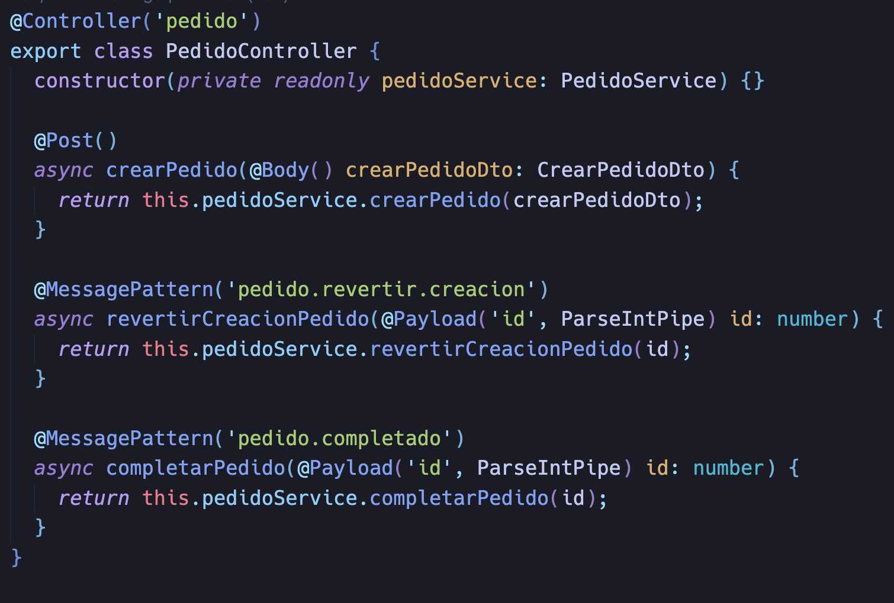
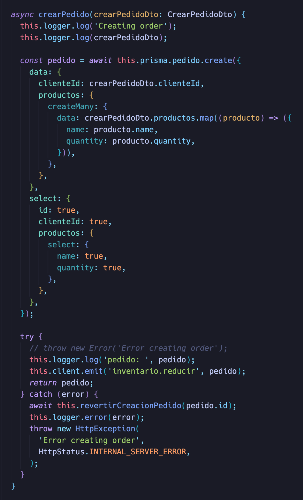
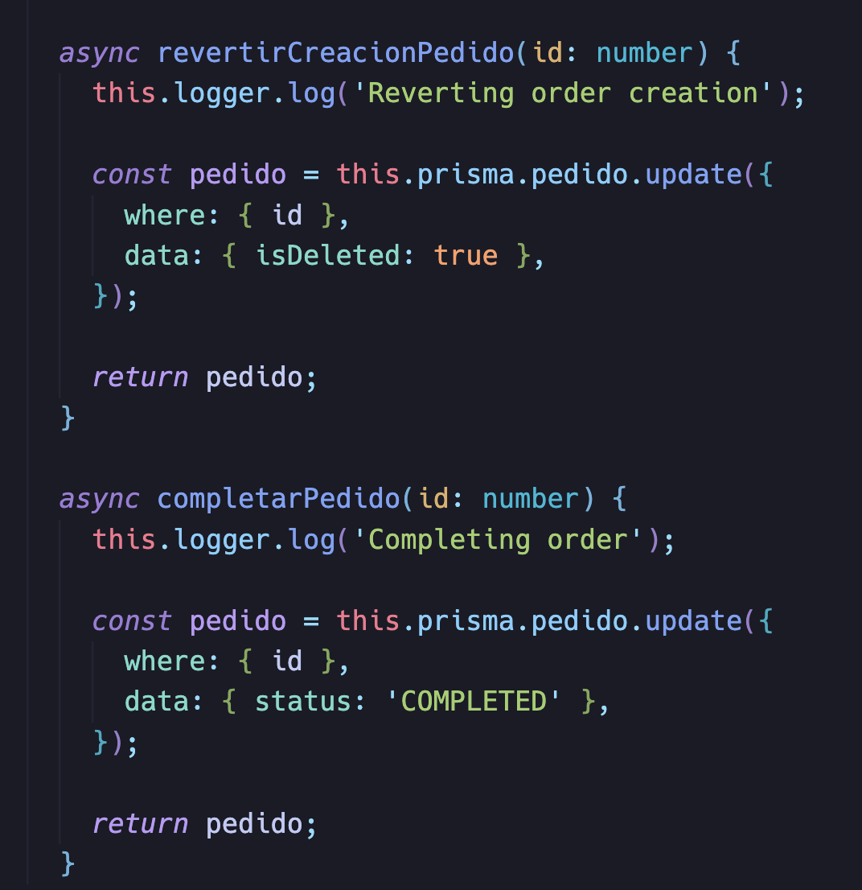
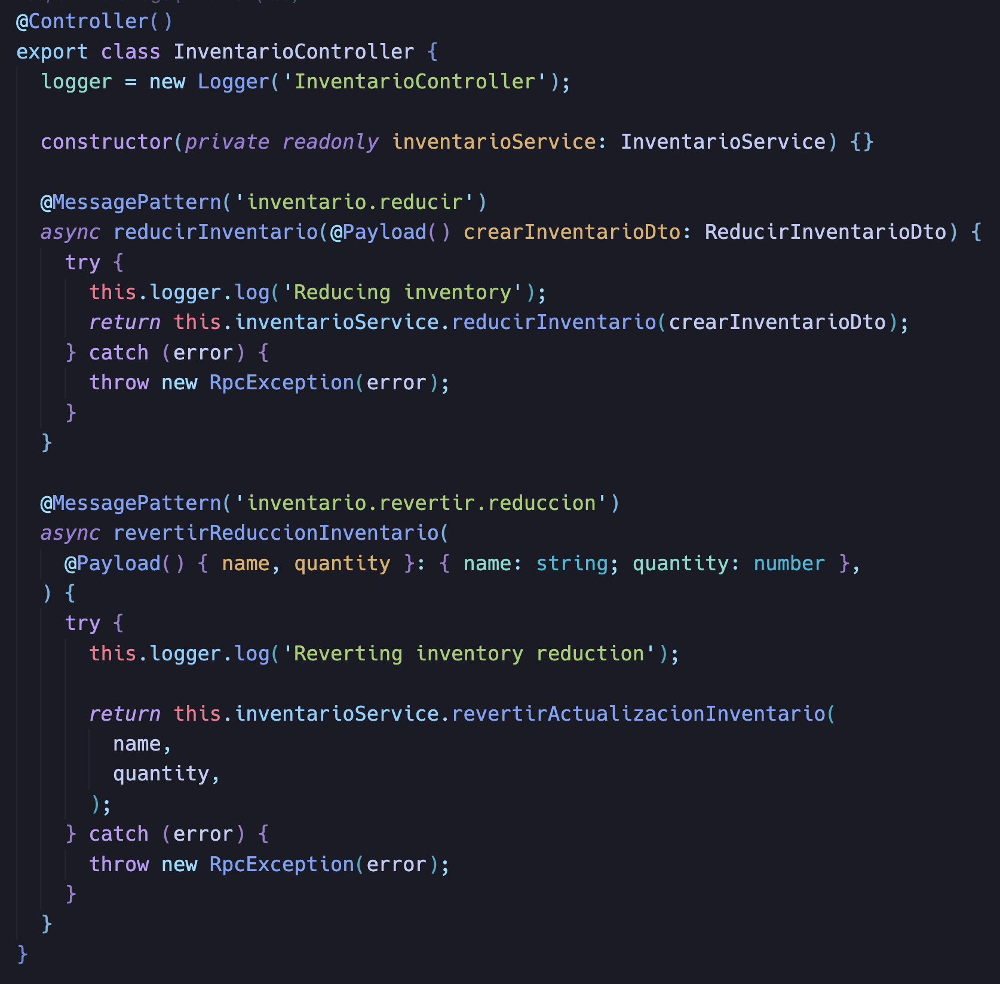
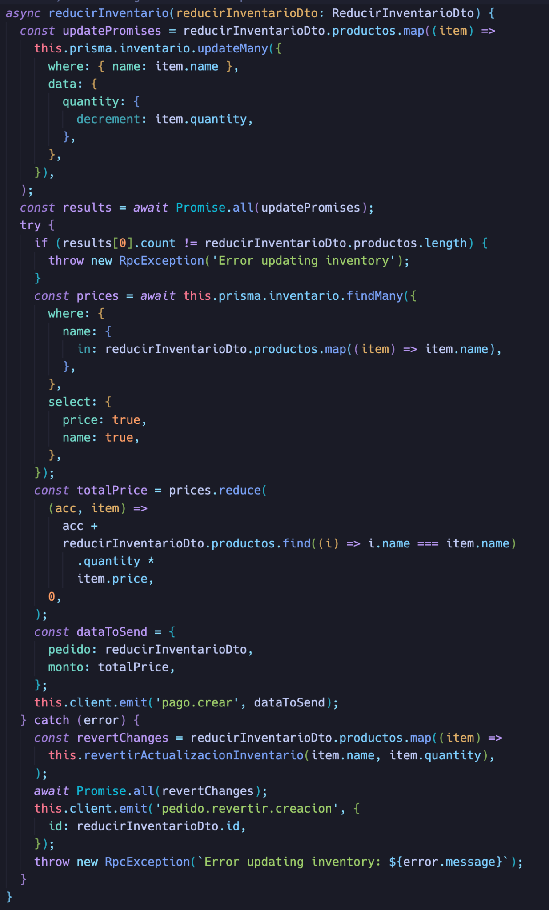
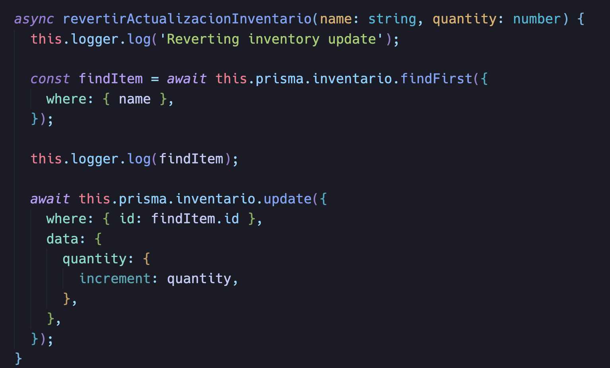
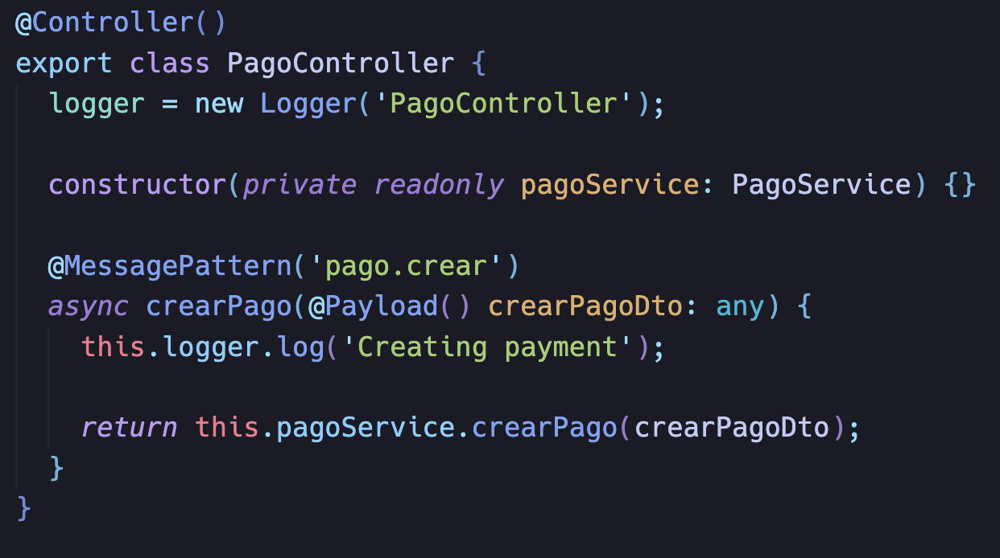
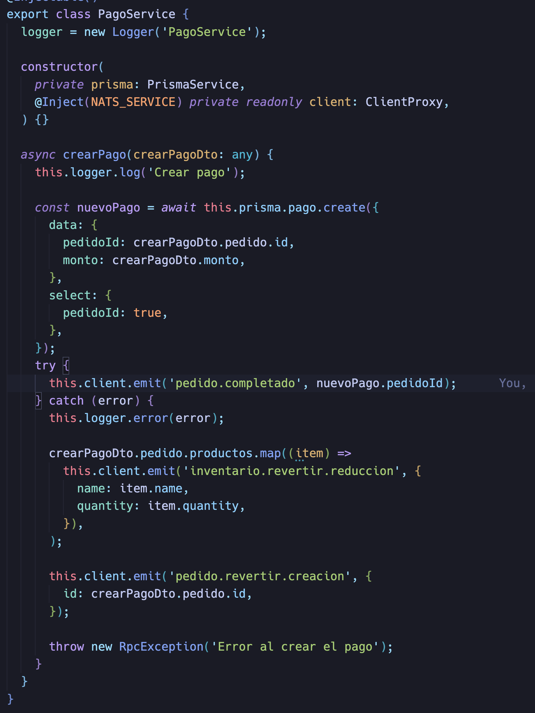

# Patrón Cloud: Compensating Transaction

## Introducción

En esta investigación se abordará el patrón de diseño **Compensating Transaction**, uno de los patrones propuestos por Microsoft para arquitecturas de software en la nube. En un mundo donde los sistemas distribuidos son cada vez más frecuentes, garantizar la consistencia de las transacciones entre múltiples servicios es un desafío clave. A través del uso de este patrón, se busca manejar los errores de forma controlada, mediante la ejecución de operaciones compensatorias que reviertan los efectos de las transacciones fallidas. Este patrón es de gran relevancia cuando no es posible utilizar transacciones distribuidas tradicionales, como en los casos donde los servicios no pueden participar en una transacción ACID.

El objetivo de este trabajo es describir en detalle el funcionamiento del patrón, explicar su contexto de uso y presentar una implementación práctica utilizando tecnologías modernas como **NestJS**, **Prisma** y **NATS** en una arquitectura basada en microservicios.

## ¿Qué es el Patrón Compensating Transaction?

El patrón **Compensating Transaction** es una técnica utilizada en sistemas distribuidos para revertir los efectos de operaciones fallidas. En un entorno tradicional, las transacciones siguen el principio ACID (Atomicidad, Consistencia, Aislamiento y Durabilidad), lo que garantiza que todas las operaciones dentro de una transacción se completen con éxito o, en caso contrario, ninguna lo haga. Sin embargo, cuando trabajamos en sistemas distribuidos, donde varios servicios interactúan entre sí, la implementación de transacciones ACID no siempre es posible o eficiente.

El patrón **Compensating Transaction** consiste en definir una operación de compensación para cada operación en el sistema. Si una parte de la transacción falla, las operaciones que ya se completaron con éxito pueden ser revertidas mediante estas transacciones compensatorias, lo que garantiza que el sistema vuelva a un estado consistente.

Este patrón es útil en los siguientes escenarios:

- Las transacciones abarcan múltiples sistemas o servicios distribuidos.
- Los recursos distribuidos no soportan transacciones ACID de manera nativa.
- Se necesita revertir operaciones sin afectar otras transacciones exitosas.

Un ejemplo común del uso de este patrón es un sistema de reservas de viajes, donde un usuario reserva un vuelo, hotel y coche en diferentes servicios. Si uno de estos servicios falla, como el de reserva del coche, las reservas del vuelo y el hotel deben ser revertidas para evitar inconsistencias en el sistema.

## Contexto de Uso

El patrón **Compensating Transaction** es especialmente útil en arquitecturas de microservicios, donde múltiples servicios autónomos necesitan colaborar para realizar una operación que abarca diferentes bases de datos o sistemas externos. A continuación, se describen algunos contextos en los que este patrón es recomendable:

1. **Sistemas distribuidos**: En arquitecturas de microservicios o sistemas distribuidos, los servicios interactúan de manera independiente y no todos soportan transacciones distribuidas. Este patrón asegura que las operaciones realizadas en diferentes servicios puedan ser revertidas en caso de fallos.

2. **Sistemas con consistencia eventual**: En aplicaciones que priorizan la disponibilidad y escalan horizontalmente, como en aplicaciones en la nube, puede que no se requiera consistencia inmediata. En este escenario, la compensación es una manera de asegurar que el sistema finalmente llegará a un estado consistente, aunque con cierta latencia.

3. **Operaciones que no se pueden deshacer de manera tradicional**: En ciertos sistemas, las operaciones, como el procesamiento de pagos o reservas, no pueden ser revertidas fácilmente, por lo que es necesario realizar pasos compensatorios. El patrón asegura que estas operaciones sean deshechas de manera controlada.

4. **Idempotencia**: Las operaciones que participan en una transacción distribuida deben ser idempotentes, es decir, que puedan ser ejecutadas múltiples veces sin causar efectos secundarios no deseados. Esto asegura que las operaciones de compensación o los reintentos no introduzcan inconsistencias adicionales en el sistema.

## Posible Aplicación del Patrón Compensating Transaction en MedSysPro

En **MedSysPro**, el patrón **Compensating Transaction** puede jugar un papel clave en la gestión de la consistencia de datos entre varios módulos interdependientes, como el módulo de gestión de citas, historial médico, teleconsulta y recetas. Dado que la plataforma maneja operaciones distribuidas, como el agendamiento de citas, la actualización de diagnósticos y la emisión de recetas, es crucial garantizar que cualquier fallo en uno de los microservicios pueda ser compensado, restaurando el estado del sistema sin afectar la experiencia del usuario.

### Escenario de Uso: Proceso de Cita, Diagnóstico y Emisión de Recetas

Un escenario donde el patrón **Compensating Transaction** sería útil en **MedSysPro** involucra el flujo de trabajo completo de una consulta médica, que incluye la gestión de citas, diagnóstico, actualización del historial médico y emisión de recetas. Este flujo de trabajo podría involucrar los siguientes módulos:

1. **Servicio de Gestión de Citas**: El paciente agenda una cita con un médico, el cual se registra en el sistema.
2. **Servicio de Historial Médico**: Durante la cita, el médico consulta y actualiza el historial médico del paciente.
3. **Servicio de Chatbot de Diagnóstico**: El chatbot sugiere diagnósticos y tratamientos basados en los síntomas ingresados por el médico.
4. **Servicio de Gestión de Recetas**: Después de la consulta, el médico genera una receta para el paciente.
5. **Servicio de Resultados**: Los resultados de análisis o estudios de laboratorio son añadidos al historial del paciente.

#### Posible Problema

Si un paciente agenda una cita y el proceso continúa normalmente, pero el **Servicio de Gestión de Recetas** falla al emitir una receta, esto dejaría el flujo en un estado inconsistente: el historial médico ya ha sido actualizado, pero el paciente no ha recibido la receta correspondiente. En este caso, el sistema necesita deshacer parte del proceso o proporcionar un mecanismo que compense este fallo.

#### Aplicación del Patrón

Para mitigar este tipo de problemas, el patrón **Compensating Transaction** permitiría definir operaciones de reversión para cada uno de los servicios en caso de fallo. Por ejemplo:

- **Transacción Principal**: El paciente agenda una cita, asiste a la consulta, el historial médico se actualiza, y se emite una receta.
- **Operación Compensatoria**: Si la receta no puede generarse correctamente, el sistema podría revertir la actualización del historial médico, dejando una notificación al médico para revisar el caso o reintentar la emisión de la receta. Alternativamente, se podría permitir que el paciente reprograme la cita para corregir el problema.

### Detalle del Flujo de Compensación

1. **Agendamiento de Citas**: El paciente agenda una cita, lo que bloquea el horario en la agenda del médico.

   - **Compensación**: Si el servicio de citas falla o se detecta un problema en el flujo, la operación compensatoria sería liberar el horario del médico y notificar al paciente.

2. **Actualización del Historial Médico**: El médico actualiza el historial médico del paciente con los detalles de la consulta.

   - **Compensación**: Si la emisión de recetas falla, la operación compensatoria sería revertir la actualización del historial médico para evitar inconsistencias en los datos clínicos.

3. **Chatbot de Diagnóstico y Sugerencia de Tratamientos**: El chatbot proporciona sugerencias de diagnóstico y tratamiento basadas en los datos del paciente.

   - **Compensación**: Si falla el proceso de generación de recetas, el sistema podría deshacer las sugerencias generadas por el chatbot o marcarlas como incompletas hasta que se pueda resolver el problema.

4. **Gestión de Recetas**: El médico emite una receta para el paciente al finalizar la consulta.
   - **Compensación**: Si la receta no puede ser emitida correctamente, el sistema puede deshacer la receta generada o notificar al médico para que reemita manualmente la receta en otro momento.

### Ejemplo en el Módulo de Gestión de Citas

- **Transacción Principal**: El paciente programa una cita, asiste a la consulta, y el historial médico es actualizado con los resultados.
- **Operación Compensatoria**: Si el médico no puede finalizar la emisión de recetas por un fallo en el sistema, el historial médico se marca como pendiente de revisión y el paciente recibe una notificación para realizar una nueva consulta o reintentar la generación de la receta.

### Ventajas del Patrón en MedSysPro

- **Consistencia de Datos**: Al aplicar operaciones compensatorias, los datos críticos del paciente, como su historial médico y recetas, se mantienen consistentes, evitando que se queden en estados intermedios.
- **Mejora en la experiencia del usuario**: En caso de fallos, el sistema garantiza que se puedan revertir los procesos sin afectar la experiencia del paciente o del médico, asegurando que la atención médica no se vea comprometida.
- **Manejo de Fallos Complejo**: Este patrón permite a **MedSysPro** manejar fallos en procesos críticos (como la emisión de recetas o la actualización de historiales médicos) de forma robusta, recuperándose de errores sin introducir inconsistencias en el sistema.

## Implementación Teórica del Patrón

Implementar el patrón **Compensating Transaction** implica realizar varias etapas clave:

1. **Dividir la operación en pasos**: El primer paso es identificar las diferentes operaciones que conforman una transacción distribuida. Cada operación debe ser claramente delimitada, y debe ser posible revertirla de manera individual.

2. **Definir operaciones compensatorias**: Para cada operación, se debe definir una transacción compensatoria que sea capaz de revertir los efectos si algo falla en el proceso. Por ejemplo, si un servicio de reserva realiza una operación que bloquea un asiento en un avión, la operación compensatoria debe liberar dicho asiento en caso de un fallo en otra parte del proceso.

3. **Orquestación de las transacciones**: Un servicio, denominado **orquestador**, es el encargado de coordinar las operaciones de la transacción distribuida. Este orquestador invoca cada operación secuencialmente y, en caso de que una falle, comienza a invocar las transacciones compensatorias en orden inverso.

4. **Gestión de fallos y reintentos**: El patrón requiere una lógica robusta para manejar los fallos. Los servicios que implementan operaciones compensatorias deben ser capaces de manejar reintentos y recuperarse de fallos intermitentes, lo que implica garantizar que estas operaciones sean idempotentes.

### Ejemplo Práctico

Consideremos un sistema de e-commerce donde un cliente puede realizar un pedido, procesar el pago y ajustar el inventario. Cada una de estas operaciones ocurre en un microservicio independiente:

- **Servicio de pedidos**: Crea el pedido en la base de datos.
- **Servicio de inventario**: Reduce el inventario del producto en cuestión.
- **Servicio de pago**: Procesa el pago del cliente.

Si el pago falla, el sistema debe revertir tanto el ajuste de inventario como la creación del pedido. Aquí es donde entran en juego las transacciones compensatorias: la operación de "cancelar pedido" y "restaurar inventario" serían las operaciones compensatorias a realizar.

## Implementación

En esta sección, se detalla cómo implementar el patrón **Compensating Transaction** utilizando microservicios para manejar las operaciones de **Pedido**, **Inventario** y **Pago**. La implementación garantiza que si ocurre un fallo en algún punto del flujo, se ejecuten operaciones compensatorias para restaurar el estado anterior del sistema y mantener la consistencia de los datos.

## Proceso Perfecto

En un escenario donde todo funciona sin fallos, el flujo de transacciones sigue estos pasos:

1. **Pedido**: El cliente crea un pedido.
   - El servicio de **Pedido** almacena el pedido y notifica al servicio de **Inventario** para que reduzca el stock.
2. **Inventario**: El servicio de **Inventario** recibe la solicitud y reduce el inventario de los productos solicitados.
   - Después de reducir el inventario, el servicio notifica a **Pago** para procesar el pago.
3. **Pago**: El servicio de **Pago** procesa el pago del pedido.
   - Si el pago es exitoso, el pedido se completa y el flujo termina satisfactoriamente.

## Proceso con Transacciones Compensatorias

Cuando ocurre un fallo en alguno de los servicios, se aplica el patrón de **Compensating Transaction** para revertir las operaciones previas y evitar inconsistencias en el sistema.

### Escenario 1: Falla en el Servicio de Pago

1. **Pedido**: El cliente realiza un pedido.
2. **Inventario**: El servicio reduce el inventario.
3. **Pago**: El servicio de **Pago** falla al procesar el pago.

**Transacción compensatoria**:

- El servicio de **Pago** emite un evento que notifica al servicio de **Inventario** que debe restaurar el stock de los productos.
- **Inventario** restaura los productos al inventario y notifica al servicio de **Pedido**.
- **Pedido** cancela el pedido en su base de datos.

### Escenario 2: Falla en el Servicio de Inventario

1. **Pedido**: El cliente realiza un pedido.
2. **Inventario**: El servicio de **Inventario** falla al intentar reducir el stock.

**Transacción compensatoria**:

- **Inventario** no realiza ninguna operación adicional y emite un evento de fallo.
- **Pedido** cancela el pedido en su base de datos, eliminando la solicitud del cliente.

### Escenario 3: Falla en el Servicio de Pedido

Si el servicio de **Pedido** falla al intentar crear el pedido, el proceso se detiene inmediatamente y no se ejecutan más operaciones, ya que los otros servicios no han recibido ninguna notificación para proceder.

## Gestión de Fallos y Eventos

Cada servicio está configurado para emitir eventos y reaccionar a ellos usando **NATS** como sistema de mensajería. Si un servicio falla, el evento emitido activa las operaciones compensatorias en los servicios correspondientes:

1. **Pedido**: Si se detecta un fallo en **Inventario** o **Pago**, el servicio cancela el pedido.
2. **Inventario**: Si se detecta un fallo en el servicio de **Pago**, el servicio restaura el inventario de los productos afectados.
3. **Pago**: Si el servicio de **Pago** falla, emite eventos a **Pedido** e **Inventario** para que ejecuten las compensaciones necesarias.

Este sistema asegura que, ante cualquier fallo, el sistema pueda volver a un estado consistente, sin dejar datos en un estado incompleto o incorrecto.

### Código de Ejemplo

Link de Repositorio: [Compensating Transaction Example](https://github.com/rodrigop23/compensating-transaction-pattern.git)

## 1. Controlador del Servicio de Pedido

El controlador del servicio de **Pedido** se encarga de manejar las solicitudes HTTP y las suscripciones a eventos enviados mediante **NATS**.

### a. Crear Pedido

    

El método `crearPedido()` en el controlador expone un endpoint **POST** que permite a los clientes crear un nuevo pedido. Recibe un DTO con los datos del pedido y lo pasa al servicio para procesarlo.

### b. Revertir Pedido (Compensación)

El método `revertirCreacionPedido()` utiliza un **MessagePattern** que escucha los eventos emitidos por otros microservicios (a través de **NATS**) bajo el patrón `'pedido.revertir.creacion'`. Cuando el servicio recibe este evento, significa que ha ocurrido un fallo en otro servicio (como **Inventario** o **Pago**) y es necesario revertir la creación del pedido.

### c. Completar Pedido

El método `completarPedido()` también utiliza un **MessagePattern** para escuchar el evento `'pedido.completado'`, el cual indica que todas las operaciones relacionadas con el pedido han sido exitosas. En este caso, se actualiza el estado del pedido a **COMPLETED** en la base de datos.

---

## 2. Servicio de Pedido

    

El servicio de **Pedido** contiene la lógica de negocio que maneja la creación y compensación de pedidos, así como su finalización.

### a. Crear Pedido

El método `crearPedido()` es responsable de crear un nuevo pedido en la base de datos usando **Prisma** como ORM. El proceso incluye los siguientes pasos:

1. **Creación del Pedido**: Se crea un registro en la base de datos que incluye los productos solicitados y el cliente que realizó el pedido.
2. **Emisión del Evento**: Una vez que el pedido ha sido creado, se emite un evento a **NATS** con el tema `'inventario.reducir'` para que el servicio de **Inventario** reduzca el stock de los productos solicitados.
3. **Manejo de Errores**: Si ocurre un error durante el proceso (como un fallo en la base de datos o en la comunicación con el servicio de **Inventario**), el pedido se revierte llamando al método `revertirCreacionPedido()`.

    

### b. Revertir Creación de Pedido (Compensación)

El método `revertirCreacionPedido()` se invoca cuando es necesario deshacer un pedido que ha sido creado. Esto ocurre cuando el servicio de **Inventario** no puede reducir el stock o el servicio de **Pago** no puede procesar el pago.

El proceso consiste en:

1. Marcar el pedido como **eliminado** (`isDeleted: true`) en la base de datos, para que no sea considerado en el sistema.
2. Este cambio asegura que el pedido no tenga efectos posteriores en el sistema, manteniendo la consistencia de los datos.

### c. Completar Pedido

    

El método `completarPedido()` se utiliza para actualizar el estado del pedido a **COMPLETED** cuando todas las operaciones asociadas (reducción de inventario y pago) han sido exitosas. Este método se invoca tras recibir el evento `'pedido.completado'` de otros microservicios.

## 1. Controlador del Servicio de Inventario

El **InventarioController** se encarga de manejar las solicitudes de actualización de inventario y las operaciones compensatorias en caso de errores. A continuación, se explican los métodos principales:

### a. Reducir Inventario

El método `reducirInventario()` escucha el evento `'inventario.reducir'` a través de **NATS**. Este evento es enviado por el servicio de **Pedido** cuando se ha creado un pedido. El método recibe los datos del pedido y los pasa al servicio de **Inventario** para reducir las cantidades de los productos solicitados.

- **Flujo**:
  1. Escucha el evento emitido por el servicio de **Pedido**.
  2. Llama al método `reducirInventario()` del servicio para actualizar el stock de los productos.

### b. Revertir Reducción de Inventario

El método `revertirReduccionInventario()` también escucha eventos a través de **NATS**, específicamente el evento `'inventario.revertir.reduccion'`. Este evento es disparado cuando algo falla en el servicio de **Pago**, indicando que se debe revertir la reducción de inventario que se realizó previamente.

- **Flujo**:
  1. Escucha el evento que indica que hay que revertir la operación de reducción.
  2. Llama al método `revertirActualizacionInventario()` del servicio para restaurar el stock.

---

## 2. Servicio de Inventario

    

El **InventarioService** maneja la lógica de negocio relacionada con la reducción y restauración de inventario. Aquí se detallan los métodos más importantes:

### a. Reducir Inventario

El método `reducirInventario()` es responsable de reducir las cantidades de los productos en el inventario cuando se recibe un pedido. A continuación se detallan sus pasos:

- **Flujo**:

  1. **Actualización del Inventario**: Se itera sobre los productos solicitados en el pedido y se reduce la cantidad disponible en la base de datos utilizando Prisma.
  2. **Validación**: Se comprueba que la cantidad de productos actualizados coincida con los productos solicitados. Si no es así, se lanza un error.
  3. **Calcular Precio Total**: Se consultan los precios de los productos actualizados para calcular el precio total del pedido.
  4. **Emisión de Evento a Pago**: Una vez calculado el precio total, se emite un evento `'pago.crear'` para que el servicio de **Pago** procese el cobro del pedido.

- **Manejo de Errores**:
  - Si ocurre un error en cualquier parte del proceso, se emiten eventos de compensación para revertir la reducción de inventario y se notifica al servicio de **Pedido** para que cancele el pedido.

### b. Revertir Actualización de Inventario (Compensación)

    

El método `revertirActualizacionInventario()` se utiliza cuando ocurre un fallo en el servicio de **Pago** y se necesita restaurar el stock de los productos. Esta es una operación de compensación que asegura que el inventario vuelva a su estado original.

- **Flujo**:
  1. **Buscar Producto**: Se busca el producto en la base de datos utilizando su nombre.
  2. **Incrementar Cantidad**: Se incrementa la cantidad del producto en la base de datos, devolviendo el stock a su estado anterior.

## 3. Controlador del Servicio de Pago

    

El controlador del servicio de **Pago** escucha eventos relacionados con la creación de pagos a través de **NATS**. A continuación, se explican sus principales métodos:

### a. Crear Pago

El método `crearPago()` escucha el evento `'pago.crear'`, que es emitido por el servicio de **Inventario** cuando se ha reducido correctamente el stock de los productos del pedido. Este método recibe los detalles del pago, incluidos el **pedidoId** y el **monto**, y los pasa al servicio para que procese el pago.

- **Flujo**:
  1. Escucha el evento `'pago.crear'` emitido por el servicio de **Inventario**.
  2. Llama al método `crearPago()` del servicio para procesar y registrar el pago.

---

## 2. Servicio de Pago

    

El **PagoService** contiene la lógica de negocio que maneja el procesamiento de pagos y la emisión de eventos a otros microservicios.

### a. Crear Pago

El método `crearPago()` es el responsable de registrar un pago en la base de datos y notificar al servicio de **Pedido** que el pago ha sido procesado exitosamente. Si el pago no puede completarse, emite eventos de compensación para revertir las operaciones anteriores.

- **Flujo**:
  1. **Registro del Pago**: Crea un nuevo registro de pago en la base de datos utilizando **Prisma**.
  2. **Notificación de Pedido Completado**: Si el pago se procesa correctamente, emite un evento `'pedido.completado'` para notificar al servicio de **Pedido** que el pedido puede ser marcado como completado.
  3. **Manejo de Errores**: Si ocurre un error durante el proceso de pago, se activan las operaciones compensatorias:
     - **Revertir Reducción de Inventario**: Se emite un evento `'inventario.revertir.reduccion'` para restaurar el stock de los productos en el servicio de **Inventario**.
     - **Revertir Creación de Pedido**: Se emite un evento `'pedido.revertir.creacion'` para notificar al servicio de **Pedido** que debe cancelar el pedido.

## Conclusión

El patrón **Compensating Transaction** es una solución eficaz en escenarios donde las transacciones distribuidas ACID no son posibles. A través de la definición de operaciones compensatorias, se asegura que el sistema pueda manejar errores y mantener la consistencia en un entorno distribuido. Este patrón se usa ampliamente en arquitecturas de microservicios y sistemas distribuidos, donde las fallas en los servicios pueden afectar transacciones críticas. En la sección siguiente, se mostrará una implementación práctica del patrón utilizando **NestJS**, **Prisma** y **NATS**, demostrando cómo se orquesta la lógica de compensación en un sistema distribuido real.

## Referencias

- Microsoft Azure Patterns: <https://learn.microsoft.com/en-us/azure/architecture/patterns/>
