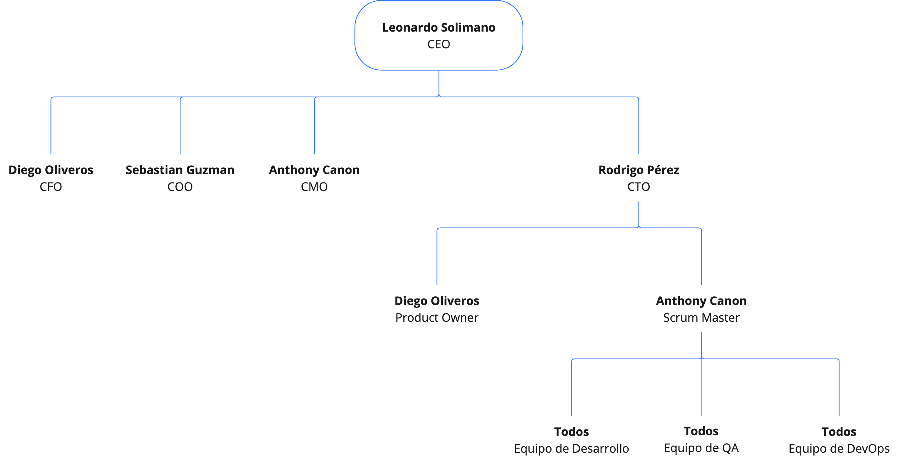

# 1.3. Estructura del Equipo

| Rol                  | Persona Asignada  | Descripción del Rol                                                                                                                                     |
| -------------------- | ----------------- | ------------------------------------------------------------------------------------------------------------------------------------------------------- |
| CEO                  | Leonardo Solimano | Responsable de la visión global del proyecto, toma decisiones estratégicas, coordina con los líderes de las distintas áreas.                            |
| CTO                  | Rodrigo Pérez     | Define la estrategia tecnológica, supervisa las decisiones técnicas y apoya al equipo de desarrollo para cumplir con los objetivos.                     |
| CFO                  | Diego Oliveros    | Gestiona las finanzas del proyecto, controla el presupuesto y asegura la viabilidad financiera del desarrollo y operación del producto.                 |
| CMO                  | Anthony Canon     | Responsable de la estrategia de marketing, promueve el producto en el mercado y asegura que las campañas estén alineadas con los objetivos del negocio. |
| COO                  | Sebastian Guzman  | Supervisa las operaciones diarias del proyecto, optimizando procesos y asegurando que las operaciones internas funcionen eficientemente.                |
| Product Owner        | Diego Oliveros    | Traduce la visión del producto en historias de usuario, prioriza el backlog y colabora directamente con el equipo de desarrollo.                        |
| Scrum Master         | Anthony Canon     | Facilita las ceremonias ágiles, elimina obstáculos y asegura que el equipo siga las prácticas de Scrum para entregar valor en cada sprint.              |
| Equipo de Desarrollo | Todos             | Desarrolla tanto la lógica de negocio en el backend como la interfaz de usuario en el frontend, asegurando la integración correcta entre ambos.         |
| Equipo de DevOps     | Rodrigo Pérez     | Gestiona la infraestructura de despliegue continuo (CI/CD), garantiza la estabilidad y escalabilidad del entorno de producción.                         |
| Equipo de QA         | Todos             | Realiza pruebas automatizadas y manuales para asegurar la calidad de las funcionalidades desarrolladas en cada sprint.                                  |

---

En el siguiente organigrama se puede observar mejor la estructura del equipo:

