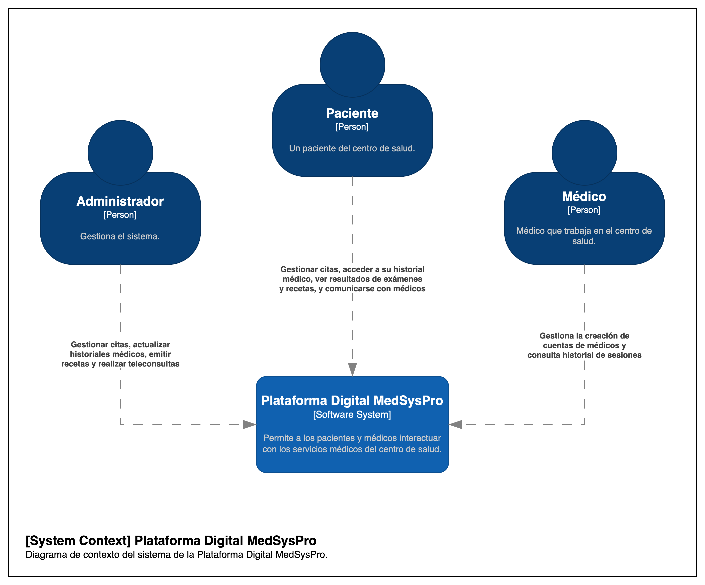

# 5.1. Contexto

## Descripción

### Plataforma Digital MedSysPro (Sistema de Software)

Es el sistema central con el que interactúan los usuarios. Permite a los pacientes y médicos interactuar con los servicios médicos del centro de salud.

### Usuarios

**1. Paciente:** Representa a los pacientes que utilizan el sistema. Las acciones que pueden realizar incluyen:

- Gestionar citas.
- Acceder a su historial médico.
- Ver resultados de exámenes y recetas.
- Comunicarse con médicos.

**2. Médico:** Representa a los médicos que trabajan en el centro de salud. Sus acciones incluyen:

- Gestionar citas.
- Consultar y actualizar el historial médico.
- Crear cuentas de médicos y consultar el historial de sesiones.

**3. Administrador:** Es el responsable de gestionar el sistema. Puede realizar tareas como:

- Gestionar citas.
- Actualizar historiales médicos.
- Emitir recetas.
- Realizar teleconsultas.

## Diagrama de Contexto

