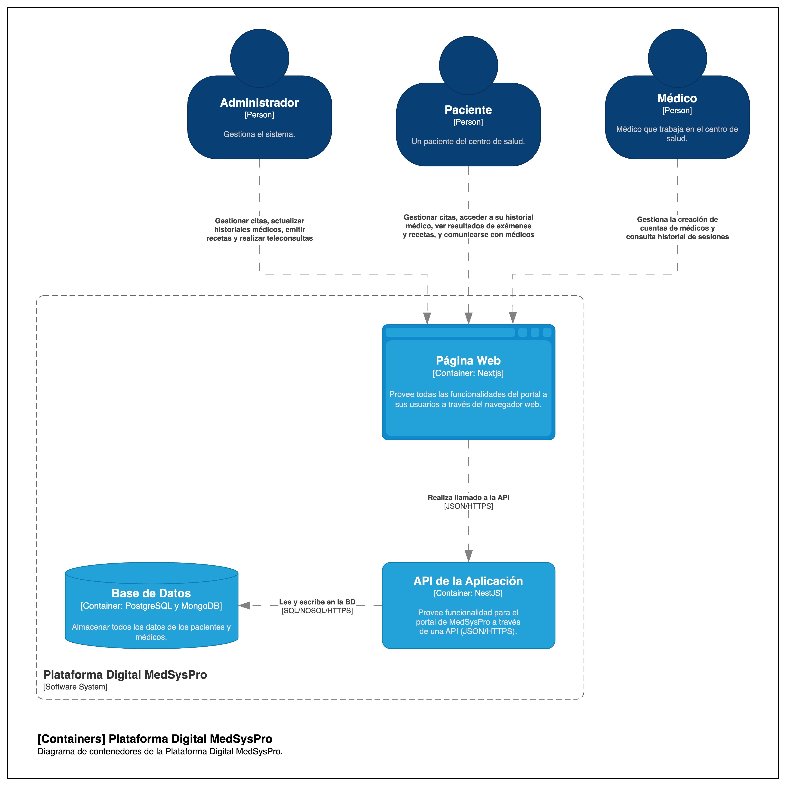

# 5.2. Contenedores

## Descripción

Tenemos los mismos usuarios que realizan las mismas acciones que el diagrama de contexto anterior. Sin embargo, en este caso, se explica un poco a detalle el sistema.

En este caso, se tiene la página web o el frontend que está construido en NextJS y provee las funcionalidades de la aplicación. Este frontend se comunica con un API que provee los servicios de la aplicación. Finalmente, el API se comunica con una base de datos que almacena la información de la aplicación.

Con este diagrama se busca mostrar cómo se comunican los diferentes componentes de la aplicación de manera general.

## Diagrama de Contenedores

