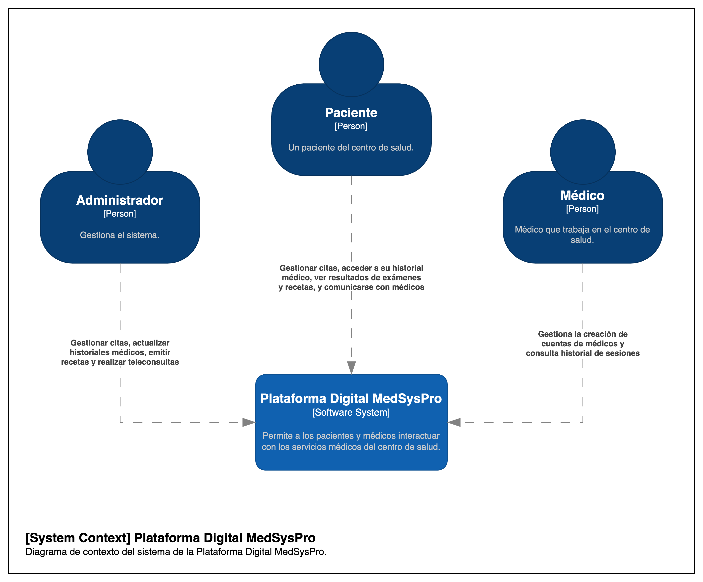
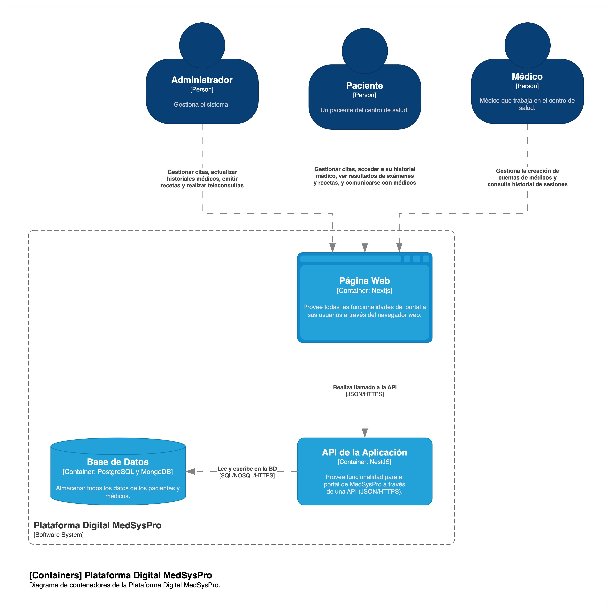

# 9.2. Iteración 1: Definir la estructura general del sistema

## Paso 2: Establecer objetivo de iteración

El objetivo de la primera iteración es la definición de la estructura y funcionamiento inicial del sistema.

## Paso 3: Elegir uno o mas elementos del sistema a refinar

El diagrama de contexto del sistema define las interacciones principales entre el sistema y los actores externos.

## Paso 4: Elegir uno o más conceptos de diseño que satisfacen el driver seleccionado
### Tabla de decisiones de diseño

| Código  | Decisión de diseño                            | Fundamentación                                                                                                     |
|---------|-----------------------------------------------|-------------------------------------------------------------------------------------------------------------------|
| DEC-01  | Uso de microservicios para los módulos clave  | Facilita la escalabilidad y mantenibilidad del sistema, permitiendo que cada módulo (perfiles, citas, etc.) funcione de forma independiente. |
| DEC-02  | Integración con sistemas externos mediante APIs estándares (FHIR, HL7) | Cumple con la restricción de interoperabilidad (CON04) y permite la conexión segura con sistemas de terceros.    |
| DEC-03  | Frontend desarrollado en NextJs con backend en NestJS | Aprovecha los conocimientos del equipo (CRN01) y facilita un desarrollo ágil, escalable y compatible con tecnologías modernas. |

## Paso 5: Instanciar elementos de Arquitectura, asignar responsabilidades y definir interfaces
| Código  | Decisión de diseño                                         | Fundamentación                                                                                                     |
|---------|------------------------------------------------------------|-------------------------------------------------------------------------------------------------------------------|
| DEC-04  | Implementación de un Gateway API                          | Centraliza las solicitudes de los actores externos y distribuye las peticiones hacia los microservicios adecuados, mejorando la seguridad y escalabilidad. |
| DEC-05  | Definición de interfaces REST para la comunicación entre microservicios | Facilita la interoperabilidad entre los módulos, alineándose con los principios de diseño desacoplado.            |
| DEC-06  | Uso de JWT (JSON Web Tokens) para la autenticación         | Garantiza un control seguro de accesos, cumpliendo con las restricciones de seguridad definidas (CON03).           |
| DEC-07  | Integración de un sistema de colas (RabbitMQ o similar)    | Mejora la respuesta del sistema en tareas críticas, como notificaciones o actualizaciones asincrónicas.            |
|DEC-08| Uso de Bases de datos postgreSQL pra la mayoria de los microservicios de la aplicación| Microservicios como el de autenticación, gestión de perfiles, gestión de citas, resultados, etc. Funcionan bien en una base de datos relacional|
|DEC-09|Uso de base de datos MongoDB para los microservicios de chat y comunicación, y chatBot de diagnósico. | Para servicios de chat, comunicación y chatbot, en los que debe haber el historial de conversaciones, es mejor usar bases de datos no relacionales.|

## Paso 6 Bosquejar vistas y registrar decisiones de diseño

## Paso 7: Analizar el diseño actual, revisar objetivo de la iteración y logro del propósito de diseño

| No abordado | Parcialmente abordado | Completamente abordado | Decisión de diseño       |
|-------------|------------------------|-------------------------|--------------------------|
|             |                        | CU-01                  | DEC-04, DEC-05, DEC-08  |
|             |                        | CU-02                  | DEC-04, DEC-05, DEC-08  |
|             |                        | CU-03                  | DEC-04, DEC-05, DEC-08  |
|             |                        | CU-04                  | DEC-04, DEC-05, DEC-08  |
|             | CU-05                  |                         | DEC-04, DEC-05          |
|             | CU-06                  |                         | DEC-04, DEC-05, DEC-09  |
|             |                        | CU-07                  | DEC-04, DEC-05, DEC-09  |
|             |                        | QA-01                  | DEC-04, DEC-06          |
|             | QA-02                  |                         | DEC-04, DEC-05, DEC-06  |
|             |                        | QA-03                  | DEC-04, DEC-06, DEC-08  |
|             |                        | QA-04                  | DEC-04, DEC-08          |
|             | QA-05                  |                         | DEC-04, DEC-05          |
|             | QA-06                  |                         | DEC-04, DEC-07          |
|             |                        | QA-07                  | DEC-04, DEC-06, DEC-09  |
|             |                        | QA-08                  | DEC-04, DEC-06          |
|             |                        | QA-09                  | DEC-04, DEC-06, DEC-08  |
|             |                        | QA-10                  | DEC-04, DEC-06          |
|             |                        | CON-01                 | DEC-04, DEC-05, DEC-08  |
|             |                        | CON-02                 | DEC-04                  |
|             |                        | CON-03                 | DEC-06                  |
|             |                        | CON-04                 | DEC-04, DEC-05, DEC-09  |
|             |                        | CON-05                 | DEC-04, DEC-05, DEC-09  |
|             |                        | CRN-01                 | DEC-03                  |
|             |                        | CRN-02                 | DEC-01, DEC-03          |
|             |                        | CRN-04                 | DEC-04, DEC-08, DEC-09  |

