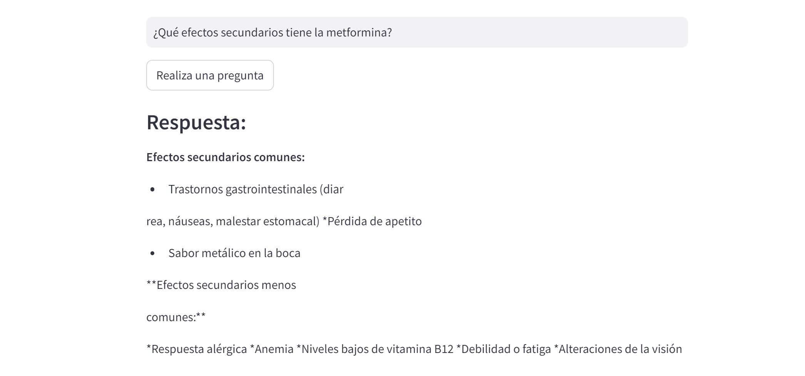

# Anthony Canon

## Nombre y carrera
#### Anthony Canon, ingeniería en sistemas

## Experiencia en desarrollo de software
#### 5 meses como practicante de desarrollo web

## Tecnologias que conozco
#### JS, C#, java, gitlab, angular

## Cual es mi expectativa del curso
#### Aprender como construir una arquitectura de software de manera optima, asi como aumentar mi conocimiento en tecnologias

## Como me veo en 10 años
#### Trabajando como ing de software o similar


# Tema individual: LLMs (Modelos de lenguaje a gran escala)

# Marco Teorico
### Modelos a gran escala
Los modelos de lenguaje a gran escala estan basados en la arquitectura de Transformers, estan 
entrenados con una gran cantidad de datos para procesar y generar texto natural. Estos modelos están diseñados para entender,
producir y modificar lenguaje humano de manera coherente, permitiendo realizar tareas  complejas
como la traducción, el análisis de texto, la generación de preguntas y respuestas, ec.

### Incrustaciones (Vectores de alto contexto)
En el tema de Procesamiento de lenguaje natural (NLP en ingles) son extremadamente importantes, ya que transforman datos de entrada (como texto o imágenes) en un formato numérico que el modelo puede procesar. En el contexto de IA generativa, las incrustaciones son representaciones densas y de baja dimensionalidad de los datos que capturan su significado semántico y estructura.
Ejemplo de secuencia de incrustaciones que representa una oración:
Oracion: "El rápido zorro marrón salta sobre el perro perezoso."
```
# Secuencia de incrustaciones que representan la oración
[0.125, -0.345, 0.678, 0.456, -0.234, 0.001, ..., 0.245, -0.876, 0.498]  # Embedding de 768 dimensiones

```

### Refinamiento
Se refiere al proceso de mejorar el rendimiento del modelo usando datos especificos, después de su entrenamiento inicial que usualmente es realizado con un gran cuerpo de datos generales de internet. Este proceso puede implicar ajustes en el modelo, en los datos de entrenamiento o en los hiperparámetros, con el objetivo de optimizar la capacidad del modelo para generalizar bien sobre datos no vistos anteriomente y reducir errores. El refinamiento es una etapa crítica para obtener un modelo que realiza la tarea de manera optima y hace predicciones robustas.
Ejemplo de opciones que  se pueden ajustar para tener mejor modelo:
```
# Hiperparametros
learning_rate = 0.001
batch_size = 32
epochs = 50
momentum = 0.9
dropout_rate = 0.5
```

### Entradas/Salidas
Los inputs/outputs pueden variar según el tipo de tarea que el modelo esté realizando. Los modelos están diseñados para crear contenido nuevo en base de los datos de entrada que reciben, por lo tanto un modelo que  recibe datos de baja calidad, pocos datos o inexactos, tendra como consecuencia un modelo que no cumple con las expectativas en cuanto a calidad de respuestas.

En cambio un modelo provisto de una gran cantidad de datos especificos a la tarea y de alta calidad, puede aportar mucho valor a una empresa de acuerdo a la necesidad.
A continuación se describen las entradas y salidas más comunes en modelos de lenguaje, especialmente aquellos que se utilizan para la generación de texto, como GPT.

**Entradas/Salidas**
1. Tarea: Q/A
- Pregunta: "¿Cuáles son los beneficios del ejercicio regular?"
- Salida: "El ejercicio regular ofrece múltiples beneficios para la salud, como mejorar la condición cardiovascular, fortalecer los músculos, reducir el riesgo de enfermedades crónicas como la diabetes tipo 2"
2. Tarea: Traducción automatica
- Entrada: "The future of technology looks promising."
- Salida: "El futuro de la tecnología parece prometedor."
3. Tarea: Resumen de texto
- Entrada: "En un artículo sobre cambio climático, los autores discuten las posibles soluciones de efectos del calentamiento global, como la adopción de energías renovables y la reducción de emisiones de carbono a nivel industrial....."
- Salida: "El artículo trata sobre soluciones al cambio climático, enfocándose en energías renovables y reducción de emisiones industriales."
  
# herramientas utilizadas

## Requerimientos
- Cuenta en Google cloud Platform / Google AI studio
- Gemini PRO API KEY
- Dataset


### Pip
```
pip install streamlit
pip install python-dotenv
pip install google-generativeai
```

## Modelos
- GPT (Generative Pretrained Transformer)
- Gemini
- BERT
### Proceso de refinamiento
1. **Carga y preparación de datos** Generar un dataset que contiene información relevante para lograr refinar el modelo, por defecto modelos como GPT y Gemini procesan simbolos como comas y signos de admiración e interrogación.
2. **Selección de modelo** Para la creación de chatbots podemos seleccionar modelos generativos como GPT o Gemini, Se entrena el modelo base seleccionado con un conjunto inicial de hiperparámetros.
3. **Revisión de la afinación** Se muestra el rendimiento del modelo con respecto a la data ingresada, que tan bien esta aprendiendo segun los hiperparametros ingresados.
4. **Evaluación** Posteriomente se puede probar el modelo, ingresando un conjunto de datos de prueba para medir la utilidad en datos no vistos

## Dataset
Dado a que el objetivo es tener un bot que responde preguntas sobre medicinas para informar a los usuarios, Se utiliza un dataset que contiene preguntas comunes sobre diferentes medicinas y sus efectos en un campo. El otro campo contiene información que deberia tener la respuesta al realizar una consulta igual o similar de la que esta en el dataset.
# Demo
## Inicio del UI del modelo
Luego de ejecutar el modelo desde la terminal con el comando de streamlit, se muestra una interfaz de usuario donde se puede realizar preguntas al modelo que ha sido afinado con datos de medicinas como:


## Acción de pregunta al modelo
Una vez hecha la pregunta el modelo  respondera en base a la data usada para afinarlo, asi como basado el sus conocimientos del pre entrenamiento que  tiene en un gran cuerpo de datos.

Se cuenta con un historial de las preguntas al final de la interfaz.
